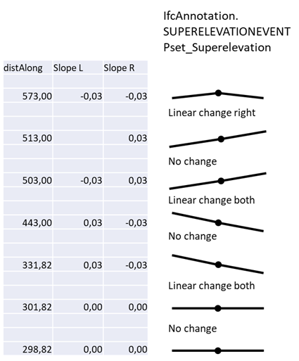

## Variations
The Following occurrence variations need to be checked and certified in relation to the targeted entities and concept templates:

- Pset_Superelevation.Side - *The test shall include all possible values (LEFT, RIGHT and BOTH)*
- Pset_Superelevation.Superelevation - *The test shall include both positive and negative values*
- Pset_Superelevation.TransitionSuperelevation - *The test shall include only LINEAR transitions*

## Model Dataset

- This test case utilises the following dataset:
  - Superelevation events according to the table below

The following tables lists the entities that shall be present in the dataset in addition to the imported entities for model setup :

´Superelevation events:

| Name | Type                              | DistanceAlong | Superelevation | Side  | TransitionSuperelevation |
| ---- | --------------------------------- | ------------- | -------------- | ----- | ------------------------ |
| SE0  | IfcAnnotation/SUPERELEVATIONEVENT | 298,82        | 0,00           | BOTH  |                          |
| SE1  | IfcAnnotation/SUPERELEVATIONEVENT | 301,82        | 0,00           | BOTH  |                          |
| SE2  | IfcAnnotation/SUPERELEVATIONEVENT | 331,82        | 0,03           | LEFT  | LINEAR                   |
| SE3  | IfcAnnotation/SUPERELEVATIONEVENT | 331,82        | -0,03          | RIGHT | LINEAR                   |
| SE4  | IfcAnnotation/SUPERELEVATIONEVENT | 443,00        | 0,03           | LEFT  |                          |
| SE5  | IfcAnnotation/SUPERELEVATIONEVENT | 443,00        | -0,03          | RIGHT |                          |
| SE6  | IfcAnnotation/SUPERELEVATIONEVENT | 503,00        | -0,03          | LEFT  | LINEAR                   |
| SE7  | IfcAnnotation/SUPERELEVATIONEVENT | 503,00        | 0,03           | RIGHT | LINEAR                   |
| SE8  | IfcAnnotation/SUPERELEVATIONEVENT | 513,00        | -0,03          | LEFT  |                          |
| SE9  | IfcAnnotation/SUPERELEVATIONEVENT | 513,00        | 0,03           | RIGHT |                          |
| SE10 | IfcAnnotation/SUPERELEVATIONEVENT | 573,00        | -0,03          | LEFT  |                          |
| SE11 | IfcAnnotation/SUPERELEVATIONEVENT | 573,00        | -0,03          | RIGHT | LINEAR                   |

## Drawings (Visualisations)

The following Drawings and visualisations describe the test case dataset to be modelled and certified.

| Filename       | Description               |
| -------------- | ------------------------- |
| Superelevation |  |

## Supporting files

| Filename                                                     | Description                                   |
| ------------------------------------------------------------ | --------------------------------------------- |
| [HorizontalAlignmentParameters](./HorizontalAlignmentParameters.csv) | Parameters for the horizontal segments as csv |
| [VerticalAlignmentParameters](./VerticalAlignmentParameters.csv) | Parameters for the vertical segments as csv   |
| [LandXML](./TOI-M14334-0000A.xml)                            | LandXML-file representing the alignment       |