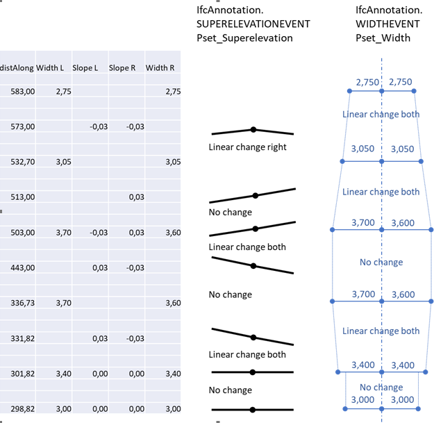

## Variations
- 

## Model Dataset

The Following occurrence variations need to be checked and certified in relation to the targeted entities and concept templates:

- Pset_Superelevation.Side - *The test shall include all possible values (LEFT, RIGHT and BOTH)*
- Pset_Superelevation.Superelevation - *The test shall include both positive and negative values*
- Pset_Superelevation.TransitionSuperelevation - *The test shall include only LINEAR transitions*
- Pset_Width.Side - *The test shall include all possible values (LEFT, RIGHT and BOTH)*
- Pset_Superelevation.TransitionWidth - *The test shall include LINEAR and CONST transitions*

| Filename                                                     | Description                                   |
| ------------------------------------------------------------ | --------------------------------------------- |
| [HorizontalAlignmentParameters](./HorizontalAlignmentParameters.csv) | Parameters for the horizontal segments as csv |
| [VerticalAlignmentParameters](./VerticalAlignmentParameters.csv) | Parameters for the vertical segments as csv   |
| [LandXML](./TOI-M14334-0000A.xml)                            | LandXML-file representing the alignment       |

## Dataset specification

### Entities table

The entities listed below are in addition to the entities listed for ALIN06.

| **Element**   | **Attribute**  | **Value**           | **Notes** |
| ------------- | -------------- | ------------------- | --------- |
| IfcAnnotation | Name           | SE0                 |           |
|               | PredefinedType | SUPERELEVATIONEVENT |           |
| IfcAnnotation | Name           | SE1                 |           |
|               | PredefinedType | SUPERELEVATIONEVENT |           |
| IfcAnnotation | Name           | SE2                 |           |
|               | PredefinedType | SUPERELEVATIONEVENT |           |
| IfcAnnotation | Name           | SE3                 |           |
|               | PredefinedType | SUPERELEVATIONEVENT |           |
| IfcAnnotation | Name           | SE4                 |           |
|               | PredefinedType | SUPERELEVATIONEVENT |           |
| IfcAnnotation | Name           | SE5                 |           |
|               | PredefinedType | SUPERELEVATIONEVENT |           |
| IfcAnnotation | Name           | SE6                 |           |
|               | PredefinedType | SUPERELEVATIONEVENT |           |
| IfcAnnotation | Name           | SE7                 |           |
|               | PredefinedType | SUPERELEVATIONEVENT |           |
| IfcAnnotation | Name           | SE8                 |           |
|               | PredefinedType | SUPERELEVATIONEVENT |           |
| IfcAnnotation | Name           | SE9                 |           |
|               | PredefinedType | SUPERELEVATIONEVENT |           |
| IfcAnnotation | Name           | SE10                |           |
|               | PredefinedType | SUPERELEVATIONEVENT |           |
| IfcAnnotation | Name           | SE11                |           |
|               | PredefinedType | SUPERELEVATIONEVENT |           |
| IfcAnnotation | Name           | WE1                 |           |
|               | PredefinedType | WIDTHEVENT          |           |
| IfcAnnotation | Name           | WE2                 |           |
|               | PredefinedType | WIDTHEVENT          |           |
| IfcAnnotation | Name           | WE3                 |           |
|               | PredefinedType | WIDTHEVENT          |           |
| IfcAnnotation | Name           | WE4                 |           |
|               | PredefinedType | WIDTHEVENT          |           |
| IfcAnnotation | Name           | WE5                 |           |
|               | PredefinedType | WIDTHEVENT          |           |
| IfcAnnotation | Name           | WE6                 |           |
|               | PredefinedType | WIDTHEVENT          |           |
| IfcAnnotation | Name           | WE7                 |           |
|               | PredefinedType | WIDTHEVENT          |           |
| IfcAnnotation | Name           | WE8                 |           |
|               | PredefinedType | WIDTHEVENT          |           |

### Properties table

| **Entity**    | **Entity Type**     | Entity Name | **PropertySet Name** | **Property Name**        | **Property Value Type**     | **Enumerated Values** | **Value type**             | **Property Value** |
| ------------- | ------------------- | ----------- | -------------------- | ------------------------ | --------------------------- | --------------------- | -------------------------- | ------------------ |
| IfcAnnotation | SUPERELEVATIONEVENT | SE0         | Pset_Superelevation  | Superelevation           | IfcRatioMeasure             |                       | IfcPropertySingleValue     | 0,00               |
|               |                     |             |                      | Side                     | IfcLabel                    |                       | IfcPropertyEnumeratedValue | BOTH               |
| IfcAnnotation | SUPERELEVATIONEVENT | SE1         | Pset_Superelevation  | Superelevation           | IfcRatioMeasure             |                       | IfcPropertySingleValue     | 0,00               |
|               |                     |             |                      | Side                     | IfcLabel                    |                       | IfcPropertyEnumeratedValue | BOTH               |
| IfcAnnotation | SUPERELEVATIONEVENT | SE2         | Pset_Superelevation  | Superelevation           | IfcRatioMeasure             |                       | IfcPropertySingleValue     | 0,03               |
|               |                     |             |                      | Side                     | IfcLabel                    |                       | IfcPropertyEnumeratedValue | LEFT               |
|               |                     |             |                      | TransitionSuperelevation | IfcLabel                    |                       | IfcPropertyEnumeratedValue | LINEAR             |
| IfcAnnotation | SUPERELEVATIONEVENT | SE3         | Pset_Superelevation  | Superelevation           | IfcRatioMeasure             |                       | IfcPropertySingleValue     | -0,03              |
|               |                     |             |                      | Side                     | IfcLabel                    |                       | IfcPropertyEnumeratedValue | RIGHT              |
|               |                     |             |                      | TransitionSuperelevation | IfcLabel                    |                       | IfcPropertyEnumeratedValue | LINEAR             |
| IfcAnnotation | SUPERELEVATIONEVENT | SE4         | Pset_Superelevation  | Superelevation           | IfcRatioMeasure             |                       | IfcPropertySingleValue     | 0,03               |
|               |                     |             |                      | Side                     | IfcLabel                    |                       | IfcPropertyEnumeratedValue | LEFT               |
| IfcAnnotation | SUPERELEVATIONEVENT | SE5         | Pset_Superelevation  | Superelevation           | IfcRatioMeasure             |                       | IfcPropertySingleValue     | -0,03              |
|               |                     |             |                      | Side                     | IfcLabel                    |                       | IfcPropertyEnumeratedValue | RIGHT              |
| IfcAnnotation | SUPERELEVATIONEVENT | SE6         | Pset_Superelevation  | Superelevation           | IfcRatioMeasure             |                       | IfcPropertySingleValue     | -0,03              |
|               |                     |             |                      | Side                     | IfcLabel                    |                       | IfcPropertyEnumeratedValue | LEFT               |
|               |                     |             |                      | TransitionSuperelevation | IfcLabel                    |                       | IfcPropertyEnumeratedValue | LINEAR             |
| IfcAnnotation | SUPERELEVATIONEVENT | SE7         | Pset_Superelevation  | Superelevation           | IfcRatioMeasure             |                       | IfcPropertySingleValue     | 0,03               |
|               |                     |             |                      | Side                     | IfcLabel                    |                       | IfcPropertyEnumeratedValue | RIGHT              |
|               |                     |             |                      | TransitionSuperelevation | IfcLabel                    |                       | IfcPropertyEnumeratedValue | LINEAR             |
| IfcAnnotation | SUPERELEVATIONEVENT | SE8         | Pset_Superelevation  | Superelevation           | IfcRatioMeasure             |                       | IfcPropertySingleValue     | -0,03              |
|               |                     |             |                      | Side                     | IfcLabel                    |                       | IfcPropertyEnumeratedValue | LEFT               |
| IfcAnnotation | SUPERELEVATIONEVENT | SE9         | Pset_Superelevation  | Superelevation           | IfcRatioMeasure             |                       | IfcPropertySingleValue     | 0,03               |
|               |                     |             |                      | Side                     | IfcLabel                    |                       | IfcPropertyEnumeratedValue | RIGHT              |
| IfcAnnotation | SUPERELEVATIONEVENT | SE10        | Pset_Superelevation  | Superelevation           | IfcRatioMeasure             |                       | IfcPropertySingleValue     | -0,03              |
|               |                     |             |                      | Side                     | IfcLabel                    |                       | IfcPropertyEnumeratedValue | LEFT               |
| IfcAnnotation | SUPERELEVATIONEVENT | SE11        | Pset_Superelevation  | Superelevation           | IfcRatioMeasure             |                       | IfcPropertySingleValue     | -0,03              |
|               |                     |             |                      | Side                     | IfcLabel                    |                       | IfcPropertyEnumeratedValue | RIGHT              |
|               |                     |             |                      | TransitionSuperelevation | IfcLabel                    |                       | IfcPropertyEnumeratedValue | LINEAR             |
| IfcAnnotation | WIDTHEVENT          | WE0         | Pset_Width           | NominalWidth             | IfcNonNegativeLengthMeasure |                       | IfcPropertySingleValue     | 3,0                |
|               |                     |             |                      | Side                     | IfcLabel                    |                       | IfcPropertyEnumeratedValue | BOTH               |
| IfcAnnotation | WIDTHEVENT          | WE1         | Pset_Width           | NominalWidth             | IfcNonNegativeLengthMeasure |                       | IfcPropertySingleValue     | 3,4                |
|               |                     |             |                      | Side                     | IfcLabel                    |                       | IfcPropertyEnumeratedValue | BOTH               |
|               |                     |             |                      | TransitionWidth          | IfcLabel                    |                       | IfcPropertyEnumeratedValue | CONST              |
| IfcAnnotation | WIDTHEVENT          | WE2         | Pset_Width           | NominalWidth             | IfcNonNegativeLengthMeasure |                       | IfcPropertySingleValue     | 3,7                |
|               |                     |             |                      | Side                     | IfcLabel                    |                       | IfcPropertyEnumeratedValue | LEFT               |
|               |                     |             |                      | TransitionWidth          | IfcLabel                    |                       | IfcPropertyEnumeratedValue | LINEAR             |
| IfcAnnotation | WIDTHEVENT          | WE3         | Pset_Width           | NominalWidth             | IfcNonNegativeLengthMeasure |                       | IfcPropertySingleValue     | 3,6                |
|               |                     |             |                      | Side                     | IfcLabel                    |                       | IfcPropertyEnumeratedValue | RIGHT              |
|               |                     |             |                      | TransitionWidth          | IfcLabel                    |                       | IfcPropertyEnumeratedValue | LINEAR             |
| IfcAnnotation | WIDTHEVENT          | WE4         | Pset_Width           | NominalWidth             | IfcNonNegativeLengthMeasure |                       | IfcPropertySingleValue     | 3,7                |
|               |                     |             |                      | Side                     | IfcLabel                    |                       | IfcPropertyEnumeratedValue | LEFT               |
| IfcAnnotation | WIDTHEVENT          | WE5         | Pset_Width           | NominalWidth             | IfcNonNegativeLengthMeasure |                       | IfcPropertySingleValue     | 3,6                |
|               |                     |             |                      | Side                     | IfcLabel                    |                       | IfcPropertyEnumeratedValue | RIGHT              |
| IfcAnnotation | WIDTHEVENT          | WE6         | Pset_Width           | NominalWidth             | IfcNonNegativeLengthMeasure |                       | IfcPropertySingleValue     | 3,05               |
|               |                     |             |                      | Side                     | IfcLabel                    |                       | IfcPropertyEnumeratedValue | BOTH               |
|               |                     |             |                      | TransitionWidth          | IfcLabel                    |                       | IfcPropertyEnumeratedValue | CONST              |
| IfcAnnotation | WIDTHEVENT          | WE7         | Pset_Width           | NominalWidth             | IfcNonNegativeLengthMeasure |                       | IfcPropertySingleValue     | 2,75               |
|               |                     |             |                      | Side                     | IfcLabel                    |                       | IfcPropertyEnumeratedValue | BOTH               |
|               |                     |             |                      | TransitionWidth          | IfcLabel                    |                       | IfcPropertyEnumeratedValue | LINEAR             |

### Spatial Containment table

| **Spatial Element** | **Spatial Element Type** | **MinSize** | **MaxSize** | **Element**   | **Element Type**    |
| ------------------- | ------------------------ | ----------- | ----------- | ------------- | ------------------- |
| IfcRoad             |                          | 12          | 12          | IfcAnnotation | SUPERELEVATIONEVENT |
| IIfcRoad            |                          | 8           | 8           | IfcAnnotation | WIDTHEVENT          |

### Product Relative Positioning table

| **Product**   | **Product Type**    | **Size** | **Positioning Element** | **Positioning Element Type** |
| ------------- | ------------------- | -------- | ----------------------- | ---------------------------- |
| IfcAnnotation | SUPERELEVATIONEVENT | 12       | IfcAlignment            |                              |
| IfcAnnotation | WIDTHEVENT          | 8        | IfcAlignment            |                              |

### Product Placement table

| **Product**   | **Product Type**    | **Product Name** | **Object Placement**              | Relative Placement Product | Relative Placement Product Type | Relative Placement Product Name |
| ------------- | ------------------- | ---------------- | --------------------------------- | -------------------------- | ------------------------------- | ------------------------------- |
| IfcAnnotation | SUPERELEVATIONEVENT | SE0              | IfcLinearPlacement at 298,82 | IfcAlignment               | na                              | A1 (from ALIN06)                |
| IfcAnnotation | SUPERELEVATIONEVENT | SE1              | IfcLinearPlacement at 301,82 | IfcAlignment               | na                              | A1 (from ALIN06)                |
| IfcAnnotation | SUPERELEVATIONEVENT | SE2              | IfcLinearPlacement at 331,82 | IfcAlignment               | na                              | A1 (from ALIN06)                |
| IfcAnnotation | SUPERELEVATIONEVENT | SE3              | IfcLinearPlacement at 331,82 | IfcAlignment               | na                              | A1 (from ALIN06)                |
| IfcAnnotation | SUPERELEVATIONEVENT | SE4              | IfcLinearPlacement at 443,00 | IfcAlignment               | na                              | A1 (from ALIN06)                |
| IfcAnnotation | SUPERELEVATIONEVENT | SE5              | IfcLinearPlacement at 443,00 | IfcAlignment               | na                              | A1 (from ALIN06)                |
| IfcAnnotation | SUPERELEVATIONEVENT | SE6              | IfcLinearPlacement at 503,00 | IfcAlignment               | na                              | A1 (from ALIN06)                |
| IfcAnnotation | SUPERELEVATIONEVENT | SE7              | IfcLinearPlacement at 503,00 | IfcAlignment               | na                              | A1 (from ALIN06)                |
| IfcAnnotation | SUPERELEVATIONEVENT | SE8              | IfcLinearPlacement at 513,00 | IfcAlignment               | na                              | A1 (from ALIN06)                |
| IfcAnnotation | SUPERELEVATIONEVENT | SE9              | IfcLinearPlacement at 513,00 | IfcAlignment               | na                              | A1 (from ALIN06)                |
| IfcAnnotation | SUPERELEVATIONEVENT | SE10             | IfcLinearPlacement at 573,00 | IfcAlignment               | na                              | A1 (from ALIN06)                |
| IfcAnnotation | SUPERELEVATIONEVENT | SE11             | IfcLinearPlacement at 573,00 | IfcAlignment               | na                              | A1 (from ALIN06)                |
| IfcAnnotation | WIDTHEVENT          | WE0              | IfcLinearPlacement at 298,82 | IfcAlignment               | na                              | A1 (from ALIN06)                |
| IfcAnnotation | WIDTHEVENT          | WE1              | IfcLinearPlacement at 301,82 | IfcAlignment               | na                              | A1 (from ALIN06)                |
| IfcAnnotation | WIDTHEVENT          | WE2              | IfcLinearPlacement at 336,73 | IfcAlignment               | na                              | A1 (from ALIN06)                |
| IfcAnnotation | WIDTHEVENT          | WE3              | IfcLinearPlacement at 336,73 | IfcAlignment               | na                              | A1 (from ALIN06)                |
| IfcAnnotation | WIDTHEVENT          | WE4              | IfcLinearPlacement at 503,00 | IfcAlignment               | na                              | A1 (from ALIN06)                |
| IfcAnnotation | WIDTHEVENT          | WE5              | IfcLinearPlacement at 503,00 | IfcAlignment               | na                              | A1 (from ALIN06)                |
| IfcAnnotation | WIDTHEVENT          | WE6              | IfcLinearPlacement at 532,70 | IfcAlignment               | na                              | A1 (from ALIN06)                |
| IfcAnnotation | WIDTHEVENT          | WE7              | IfcLinearPlacement at 583,00 | IfcAlignment               | na                              | A1 (from ALIN06)                |

## Drawings (Visualisations)

The following Drawings and visualisations describe the test case dataset to be modelled and certified.

| Filename                 | Description                                                |
| ------------------------ | ---------------------------------------------------------- |
| Superelevation and Width |  |

## Supporting files

| Filename                                                     | Description                                   |
| ------------------------------------------------------------ | --------------------------------------------- |
| [HorizontalAlignmentParameters](./HorizontalAlignmentParameters.csv) | Parameters for the horizontal segments as csv |
| [VerticalAlignmentParameters](./VerticalAlignmentParameters.csv) | Parameters for the vertical segments as csv   |
| [LandXML](./TOI-M14334-0000A.xml)                            | LandXML-file representing the alignment       |