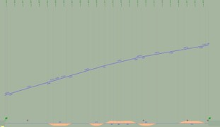

## Variations
The following occurrence variations need to be checked and certified in relation to the targeted entities and concept templates:

- IfcAlignmentHorizontalSegment - *includes LINE, CIRCULARARC and CLOTHOID*
- IfcAlignmentVerticalSegment - *includes CONSTANTGRADIENT and CIRCULARARC*
- IfcAlignmentCantSegment - *includes CONSTANTCANT and LINEARTRANSITION*

## Model Dataset
This test case utilises the attached dataset documented by the following drawings and data schedule. 

Entities Table

> **HOW TO USE IT**: list first the entities' attributes and their values. Then, if needed, add additional information (e.g., placement, material, etc.). Be careful not to be redundant with other rules (e.g. placement-specific rules, material-specific rules, etc.)

| **Element**            | **Attribute**   | **Value**                 | **Notes**                       |
|------------------------|-----------------|---------------------------|---------------------------------|
| IfcProject             | Name            | 'IFC4.3AbRV Project'      |                                 |
| IfcSite                | Name            | Site_1                    |                                 |
| IfcRailway             | Name            | Railway_1                 |                                 |
| IfcAlignment           | Name            | Alignment_1               |                                 |
|                        | ObjectType      | Railway track alignment   |                                 |
|                        | PredefinedType  | USERDEFINED               |                                 |
| IfcAlignmentHorizontal | Name            | AH1                       |                                 |
| IfcAlignmentVertical   | Name            | AV1                       |                                 |
| IfcAlignmentCant       | Name            | AC1                       |                                 |
| IfcMapConversion       | Eastings        | 24525000                  |                                 |
|                        | Northings       | 6876000                   |                                 |
|                        | OrthogonalHeight| 0                         |                                 |
|                        | XAxisAbscissa   | 1                         |                                 |
|                        | XAxisOrdinate   | 0                         |                                 |
|                        | Scale           | 1                         |                                 |
| IfcProjectedCRS        | Name            | EPSG:3878                 |                                 |
|                        | GeodeticDatum   | EPSG:6258                 |                                 |
|                        | VerticalDatum   | EPSG:6150                 |                                 |

**Note**: Unspecified OPTIONAL attributes can be $ (null).

The complete list of entities that should be instantiated are:
- IfcProject
- IfcDirection
- IfcCartesianPoint
- IfcAxis2Placement3D
- IfcGeometricRepresentationContext
- IfcMapConversion
- IfcProjectedCRS
- IfcSIUnit
- IfcUnitAssignment
- IfcSite
- IfcLocalPlacement
- IfcRelAggregates
- IfcRelContainedInSpatialStructure
- IfcAlignment
- IfcAlignmentHorizontal
- IfcAlignmentVertical
- IfcAlignmentCant
- IfcAlignmentSegment
- IfcAlignmentHorizontalSegment
- IfcAlignmentVerticalSegment
- IfcAlignmentCantSegment
- IfcRelNests
- IfcCompositeCurve
- IfcLine
- IfcCircle
- IfcClothoid
- IfcGradientCurve
- IfcSegmentedReferenceCurve
- IfcCurveSegment
- IfcProductDefinitionShape
- IfcShapeRepresentation
- IfcVector
- IfcAxis2Placement2D  

Spatial (De)Composition Table

| **Parent Element** | **Parent Element Type** | **Parent Element Name** | **MinSize** | **MaxSize** | **Child Element** | **Child Element Type** | **Child Element Name** |
|--------------------|-------------------------|-------------------------|-------------|-------------|-------------------|------------------------|------------------------|
| IfcProject         |                 | IFC4.3AbRV Project                  | 1           | 1           | IfcSite   |          | Site_1            |
| IfcSite         |                 | Site_1                  | 1           | 1           | IfcRailway   |          | Railway_1            |

**NOTE**:
- when **MinSize** and **MaxSize** have the same value, it means exactly. Example: MinSize=MaxSize=1, means that the Parent Element must aggregates exactly 1 Child Element with that Type (and Name).

Spatial Containment Table

| **Spatial Element** | **Spatial Element Type** | **Spatial Element Name** | **MinSize** | **MaxSize** | **Element**     | **Element Type** | **Element Name** |
|---------------------|--------------------------|--------------------------|-------------|-------------|-----------------|------------------|------------------|
| IfcSite     |            | Site_1             | 1           | 1           | IfcAlignment         | Railway track alignment             | Alignment_1        |

**NOTE**:
- when **MaxSize is empty**, it means **unlimited**. Example: MinSize=1; MaxSize=empty, means that the Spatial Element must contain 1 or more elements of the requested type.
- when **MinSize** and **MaxSize** have the same value, it means exactly. Example: MinSize=MaxSize=1, means that the Spatial Element must contain exactly 1 Element with that Type (and Name).

Product Placement Table

| **Product**     | **Product Type** | **Product Name**     | **Object Placement** |Relative Placement Product | Relative Placement Product Type | Relative Placement Product Name |
|-----------------|------------------|----------------------|----------------------|----------------------------|---------------------------------|---------------------------------|
| IfcAlignment     | Railway track alignment          | Alignment_1               | IfcLocalPlacement   |    IfcSite            |                              | Site_1             |
| IfcRailway     |           | Railway_1               | IfcLocalPlacement   |    IfcSite            |                               | Site_1             |
| IfcSite     |           | Site_1               | IfcLocalPlacement   |                |                              |              |
**NOTE**:
- Columns **Relative Placement Product**, **Relative Placement Product Type**, **Relative Placement Product Name** are optional. If omitted, it means the Object Placement of the Product has no PlacementRelTo attribute.

Alignment Table

Alignment_1 has layouts (AH1, AV1, AC1) data as follows:
  
**HORIZONTAL**
| Entity                        | PredefinedType | Name | Start Point X (m) | Start Point Y (m) | Start Direction (rad) | Start Radius Of Curvature (m) | End Radius Of Curvature (m) | Segment Length (m) | Gravity Center Line Height (m) |
|-------------------------------|----------------|------|-------------------|-------------------|-----------------------|-------------------------------|-----------------------------|--------------------|--------------------------------|
| IfcAlignmentHorizontalSegment | LINE           | H1   | 1213636.851       | 2723135.638       | 3.098579538           | 0                             | 0                           | 18.11881           | $                              |
| IfcAlignmentHorizontalSegment | CIRCULARARC    | H2   | 1213618.749       | 2723136.417       | 3.098582679           | 30000                         | 30000                       | 10.43075           | $                              |
| IfcAlignmentHorizontalSegment | LINE           | H3   | 1213608.328       | 2723136.864       | 3.098930297           | 0                             | 0                           | 488.5896           | $                              |
| IfcAlignmentHorizontalSegment | CLOTHOID       | H4   | 1213120.183       | 2723157.702       | 3.098930297           | 0                             | -467                        | 72                 | $                              |
| IfcAlignmentHorizontalSegment | CIRCULARARC    | H5   | 1213048.37        | 2723162.618       | 3.021842524           | -467                          | -467                        | 157.77472          | $                              |
| IfcAlignmentHorizontalSegment | CLOTHOID       | H6   | 1212897.842       | 2723207.321       | 2.683995179           | -467                          | 0                           | 72                 | $                              |
| IfcAlignmentHorizontalSegment | LINE           | H7   | 1212834.985       | 2723242.397       | 2.606907407           | 0                             | 0                           | 191.97447          | $                              |
| IfcAlignmentHorizontalSegment | CLOTHOID       | H8   | 1212669.805       | 2723340.221       | 2.606907407           | 0                             | -472                        | 68                 | $                              |
| IfcAlignmentHorizontalSegment | CIRCULARARC    | H9   | 1212612.158       | 2723376.258       | 2.534873515           | -472                          | -472                        | 67.74031           | $                              |
| IfcAlignmentHorizontalSegment | CLOTHOID       | H10  | 1212559.465       | 2723418.736       | 2.391355823           | -472                          | 0                           | 68                 | $                              |
| IfcAlignmentHorizontalSegment | CLOTHOID       | H11  | 1212512.016       | 2723467.423       | 2.319321931           | 0                             | 467                         | 65                 | $                              |
| IfcAlignmentHorizontalSegment | CIRCULARARC    | H12  | 1212466.696       | 2723513.999       | 2.38891512            | 467                           | 467                         | 46.06931           | $                              |
| IfcAlignmentHorizontalSegment | CLOTHOID       | H13  | 1212431.574       | 2723543.783       | 2.487564585           | 467                           | 904                         | 39                 | $                              |
| IfcAlignmentHorizontalSegment | CIRCULARARC    | H14  | 1212399.816       | 2723566.408       | 2.550891239           | 904                           | 904                         | 44.63924           | $                              |
| IfcAlignmentHorizontalSegment | CLOTHOID       | H15  | 1212362.142       | 2723590.345       | 2.60027095            | 904                           | 470                         | 39                 | $                              |
| IfcAlignmentHorizontalSegment | CIRCULARARC    | H16  | 1212328.17        | 2723609.486       | 2.663331196           | 470                           | 470                         | 91.20524           | $                              |
| IfcAlignmentHorizontalSegment | CLOTHOID       | H17  | 1212243.646       | 2723643.367       | 2.857384861           | 470                           | 0                           | 66                 | $                              |
| IfcAlignmentHorizontalSegment | CLOTHOID       | H18  | 1212179.511       | 2723658.885       | 2.927597572           | 0                             | -462                        | 66                 | $                              |
| IfcAlignmentHorizontalSegment | CIRCULARARC    | H19  | 1212115.383       | 2723674.429       | 2.856169065           | -462                          | -462                        | 93.4246            | $                              |
| IfcAlignmentHorizontalSegment | CLOTHOID       | H20  | 1212028.998       | 2723709.589       | 2.653951343           | -462                          | 0                           | 87                 | $                              |
| IfcAlignmentHorizontalSegment | LINE           | H21  | 1211954.877       | 2723755.075       | 2.559795455           | 0                             | 0                           | 254.74363          | $                              |
| IfcAlignmentHorizontalSegment | CLOTHOID       | H22  | 1211742.044       | 2723895.063       | 2.559795455           | 0                             | 870                         | 81                 | $                              |
| IfcAlignmentHorizontalSegment | CIRCULARARC    | H23  | 1211673.695       | 2723938.516       | 2.606347104           | 870                           | 870                         | 182.71801          | $                              |
| IfcAlignmentHorizontalSegment | CLOTHOID       | H24  | 1211507.933       | 2724014.584       | 2.816367914           | 870                           | 0                           | 74                 | $                              |
| IfcAlignmentHorizontalSegment | LINE           | H25  | 1211437.176       | 2724036.23        | 2.858896596           | 0                             | 0                           | 33.63773           | $                              |

**VERTICAL**
| Entity                      | Predefined Type  | Name | Start Dist Along (m) | Horizontal Length (m) | Start Height (m) | Start Gradient (ratio) | End Gradient (ratio) | Radius Of Curvature (m) |
|-----------------------------|------------------|------|----------------------|-----------------------|------------------|------------------------|----------------------|-------------------------|
| IfcAlignmentVerticalSegment | CONSTANTGRADIENT | V1   | 0                    | 61.67186              | 459.1209         | 0.00665013             | 0.00665013           | 0                       |
| IfcAlignmentVerticalSegment | CIRCULARARC      | V2   | 61.67185             | 0.75008               | 459.531          | 0.00665013             | 0.0059               | 1000                    |
| IfcAlignmentVerticalSegment | CONSTANTGRADIENT | V3   | 62.42194             | 462.76333             | 459.5357         | 0.0059                 | 0.0059               | 0                       |
| IfcAlignmentVerticalSegment | CIRCULARARC      | V4   | 525.18527            | 0.59997               | 462.266          | 0.0059                 | 0.0055               | 1500                    |
| IfcAlignmentVerticalSegment | CONSTANTGRADIENT | V5   | 525.78524            | 107.84169             | 462.2694         | 0.0055                 | 0.0055               | 0                       |
| IfcAlignmentVerticalSegment | CIRCULARARC      | V6   | 633.62692            | 0.64997               | 462.8626         | 0.0055                 | 0.00615              | -1000                   |
| IfcAlignmentVerticalSegment | CONSTANTGRADIENT | V7   | 634.27689            | 159.04448             | 462.8663         | 0.00615                | 0.00615              | 0                       |
| IfcAlignmentVerticalSegment | CIRCULARARC      | V8   | 793.32136            | 0.59997               | 463.8445         | 0.00615                | 0.00585              | 2000                    |
| IfcAlignmentVerticalSegment | CONSTANTGRADIENT | V9   | 793.92134            | 413.39066             | 463.8481         | 0.00585                | 0.00585              | 0                       |
| IfcAlignmentVerticalSegment | CIRCULARARC      | V10  | 1207.31201           | 0.73497               | 466.2664         | 0.00585                | 0.0048               | 700                     |
| IfcAlignmentVerticalSegment | CONSTANTGRADIENT | V11  | 1208.04695           | 380.96596             | 466.2703         | 0.0048                 | 0.0048               | 0                       |
| IfcAlignmentVerticalSegment | CIRCULARARC      | V12  | 1589.01293           | 0.65998               | 468.099          | 0.0048                 | 0.00425              | 1200                    |
| IfcAlignmentVerticalSegment | CONSTANTGRADIENT | V13  | 1589.6729            | 97.23633              | 468.1019         | 0.00425                | 0.00425              | 0                       |
| IfcAlignmentVerticalSegment | CIRCULARARC      | V14  | 1686.90923           | 0.62999               | 468.5152         | 0.00425                | 0.00355              | 900                     |
| IfcAlignmentVerticalSegment | CONSTANTGRADIENT | V15  | 1687.5392            | 334.36918             | 468.5177         | 0.00355                | 0.00355              | 0                       |
| IfcAlignmentVerticalSegment | CIRCULARARC      | V16  | 2021.9084            | 0.69999               | 469.7047         | 0.00355                | 0.003454             | 7000                    |
| IfcAlignmentVerticalSegment | CONSTANTGRADIENT | V17  | 2022.60838           | 361.601               | 469.7071         | 0.00345                | 0.00345              | 0                       |
| IfcAlignmentVerticalSegment | CIRCULARARC      | V18  | 2384.20938           | 0.65999               | 470.9546         | 0.00345                | 0.0029               | 1200                    |
| IfcAlignmentVerticalSegment | CONSTANTGRADIENT | V19  | 2384.86938           | 92.80174              | 470.9567         | 0.0029                 | 0.0029               | 0                       |
| IfcAlignmentVerticalSegment | CIRCULARARC      | V20  | 2477.67111           | 0.3953                | 471.2258         | 0.0029                 | 0.00369              | -500                    |

**CANT**
| Entity                  | Predefined Type  | Start Dist Along (m) | Horizontal Length (m) | Start Cant Left(m) | End Cant Left (m) | Start Cant Right (m) | End Cant Right (m) |
|-------------------------|------------------|----------------------|-----------------------|--------------------|-------------------|----------------------|--------------------|
| IfcAlignmentCantSegment | CONSTANTCANT     | 0                    | 0.00263               | 0                  | 0                 | 0                    | 0                  |
| IfcAlignmentCantSegment | CONSTANTCANT     | 0.00262              | 517.13653             | 0                  | 0                 | 0                    | 0                  |
| IfcAlignmentCantSegment | LINEARTRANSITION | 517.13915            | 72                    | 0                  | -0.063            | 0                    | 0.063              |
| IfcAlignmentCantSegment | CONSTANTCANT     | 589.13915            | 157.77472             | -0.063             | -0.063            | 0.063                | 0.063              |
| IfcAlignmentCantSegment | CONSTANTCANT     | 746.91387            | 72                    | -0.063             | 0                 | 0.063                | 0                  |
| IfcAlignmentCantSegment | CONSTANTCANT     | 818.91387            | 191.97447             | 0                  | 0                 | 0                    | 0                  |
| IfcAlignmentCantSegment | LINEARTRANSITION | 1010.88834           | 68                    | 0                  | -0.063            | 0                    | 0.063              |
| IfcAlignmentCantSegment | CONSTANTCANT     | 1078.88834           | 67.74031              | -0.063             | -0.063            | 0.063                | 0.063              |
| IfcAlignmentCantSegment | CONSTANTCANT     | 1146.62865           | 68                    | -0.063             | 0                 | 0.063                | 0                  |
| IfcAlignmentCantSegment | CONSTANTCANT     | 1214.62866           | 65                    | 0                  | 0.062             | 0                    | -0.062             |
| IfcAlignmentCantSegment | CONSTANTCANT     | 1279.62866           | 46.06931              | 0.062              | 0.062             | -0.062               | -0.062             |
| IfcAlignmentCantSegment | LINEARTRANSITION | 1325.69796           | 39                    | 0.062              | 0.0325            | -0.062               | -0.0325            |
| IfcAlignmentCantSegment | CONSTANTCANT     | 1364.69797           | 44.63924              | 0.0325             | 0.0325            | -0.0325              | -0.0325            |
| IfcAlignmentCantSegment | CONSTANTCANT     | 1409.33721           | 39                    | 0.0325             | 0.063             | -0.0325              | -0.063             |
| IfcAlignmentCantSegment | CONSTANTCANT     | 1448.33721           | 91.20524              | 0.063              | 0.063             | -0.063               | -0.063             |
| IfcAlignmentCantSegment | LINEARTRANSITION | 1539.54245           | 66                    | 0.063              | 0                 | -0.063               | 0                  |
| IfcAlignmentCantSegment | LINEARTRANSITION | 1605.54245           | 66                    | 0                  | -0.063            | 0                    | 0.063              |
| IfcAlignmentCantSegment | CONSTANTCANT     | 1671.54245           | 93.4246               | -0.063             | -0.063            | 0.063                | 0.063              |
| IfcAlignmentCantSegment | CONSTANTCANT     | 1764.96705           | 87                    | -0.063             | 0                 | 0.063                | 0                  |
| IfcAlignmentCantSegment | CONSTANTCANT     | 1851.96705           | 254.74363             | 0                  | 0                 | 0                    | 0                  |
| IfcAlignmentCantSegment | CONSTANTCANT     | 2106.71067           | 81                    | 0                  | 0.0375            | 0                    | -0.0375            |
| IfcAlignmentCantSegment | CONSTANTCANT     | 2187.71067           | 182.71801             | 0.0375             | 0.0375            | -0.0375              | -0.0375            |
| IfcAlignmentCantSegment | LINEARTRANSITION | 2370.42869           | 74                    | 0.0375             | 0                 | -0.0375              | 0                  |
| IfcAlignmentCantSegment | CONSTANTCANT     | 2444.42869           | 33.63773              | 0                  | 0                 | 0                    | 0                  |
  
**NOTE**:
- Coordinates are defined based on Swiss Grid (EPSG: 3878). In the IFC file, they should be adjusted based on Georeferencing information provided by IfcProjectedCRS and IfcMapConversion (see Entities Table).

Product Geometric Representation Table

> OPTION 1: Use this template if you need to check at predefined type or object type level

| **Product**     | **Product Type** | **Representation Identifier** | **Representation Type** |**Items**           |
|-----------------|------------------|-------------------------------|-------------------------|--------------------|
| IfcAlignment    | Railway track alignment               | Axis                          |       Curve3D           |1 IfcGradientCurve  |
| IfcAlignmentHorizontal    |                | Axis                          |       Curve2D           |1 IfcCompositeCurve  |
| IfcAlignmentVertical    |               | Axis                          |       Curve3D           |1 IfcGradientCurve  |
| IfcAlignmentCant    |                | Axis                          |       Curve3D           |1 IfcSegmentedReferenceCurve  |
| IfcAlignmentSegment    |                | Axis                          |       Segment           |1 IfcCurveSegment  |
  
**NOTE**:
- Items should be listed in the cell with their number.
- One shape representation for a product should be documented in one row. If there are multiple representations, they should be documented in multiple rows.

*This is a later step that involved the detailed documentation of the certification dataset (model)*

## Drawings (Visualisations)
The following Drawings and visualisations describe the test case dataset to be modelled and certified.

*Fig. 1 Alignment horizontal layout*

*Fig. 2 Alignment vertical layout*

*Fig. 3 Alignment cant layout*
## Supporting files

| Filename                          | Description                               |
|-----------------------------------|-------------------------------------------|
| *filename*                        | *short description*                       |
