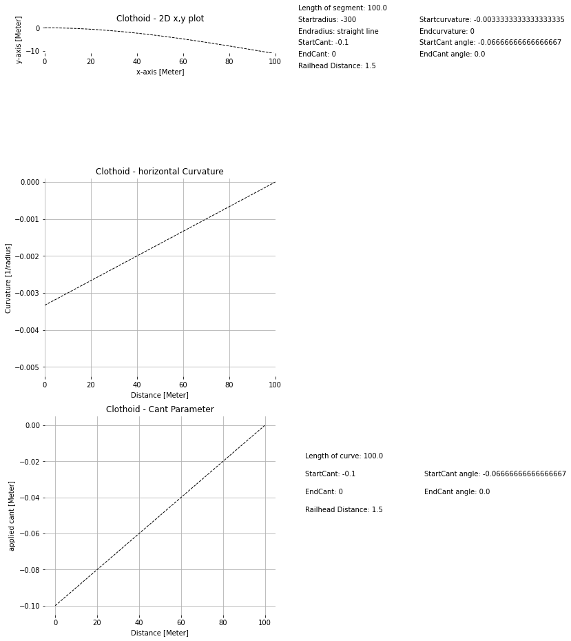

# Variation ALRW2_04 (Clothoid)

## Segment parameters

* Segmenttype: Clothoid (linear change of curvature)

* Total length of segment: 100.0

* Length Unit: Meter

* Startradius: -300 (right leaning)

* Endradius: straight line

* Startcurvature ( 1 / Startradius): -0.0033333333333333335

* Endcurvature ( 1 / Endradius): 0

* StartCantLeft: 0.1

* EndCantLeft: 0

* StartCantRight: 0

* EndCantRight: 0

* Increments (stepsize in Meter): 1

## Standardplots

## Files

| Filename                      | Content |
| ----------------------------- | --------------------------------------------------------------------------------------------- |
| ALRW2_04.ifc | The IFC reference file contains all entities carrying the relevant railway domain specific parameters. |
| ALRW2_04.png | png-file showing x/y-plot, curvature-plot and cant-plot  |
| ALRW2_04.xlsx | The EXCEL file contains a pointlist for the given segment obtained directly from the railway domain specific parameters.  |
| ALRW2_04_geometry.ifc | The second IFC reference file is enriched with the entities defining the 3D geometry of the segment.  |
| ALRW2_04_geometry_pointlist.txt | pointlist for the given segments obtained directly from the IFC-geometry  |
| README.md | Documentation for current github folder  |

