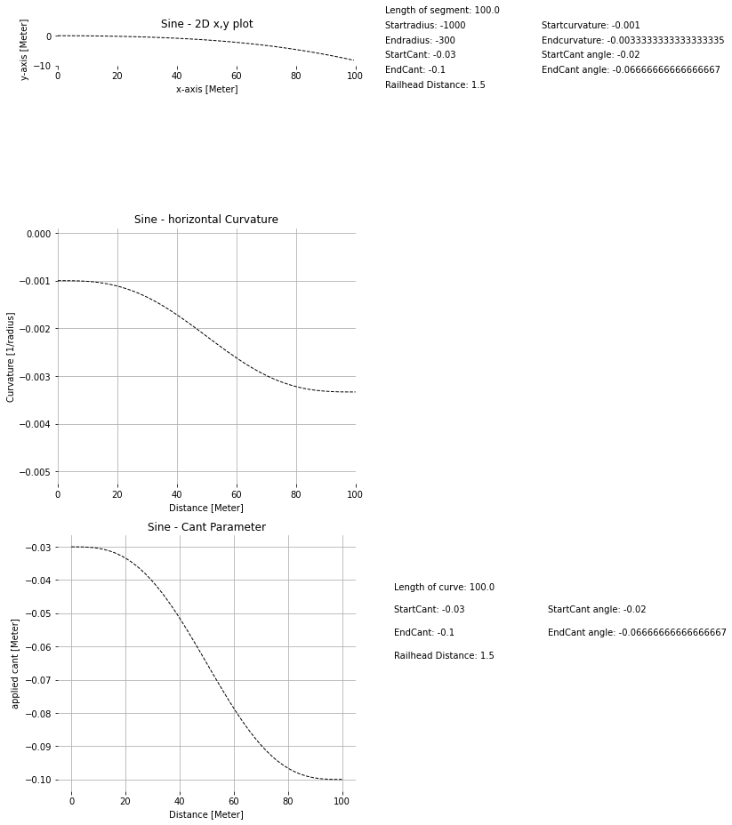

# Variation ALRW5_06 (Sine)

## Segment parameters

* Segmenttype: Sine (nonlinear change of curvature)

* Total length of segment: 100.0

* Length Unit: Meter

* Startradius: -1000 (right leaning)

* Endradius: -300 (right leaning)

* Startcurvature ( 1 / Startradius): -0.001

* Endcurvature ( 1 / Endradius): -0.0033333333333333335

* StartCantLeft: 0.03

* EndCantLeft: 0.1

* StartCantRight: 0

* EndCantRight: 0

* Increments (stepsize in Meter): 1

## Standardplots

## Files

| Filename                      | Content |
| ----------------------------- | --------------------------------------------------------------------------------------------- |
| ALRW5_06.ifc | The IFC reference file contains all entities carrying the relevant railway domain specific parameters. |
| ALRW5_06.png | png-file showing x/y-plot, curvature-plot and cant-plot  |
| ALRW5_06.xlsx | The EXCEL file contains a pointlist for the given segment obtained directly from the railway domain specific parameters.  |
| ALRW5_06_geometry.ifc | The second IFC reference file is enriched with the entities defining the 3D geometry of the segment.  |
| ALRW5_06_geometry_pointlist.txt | pointlist for the given segments obtained directly from the IFC-geometry  |
| README.md | Documentation for current github folder  |

