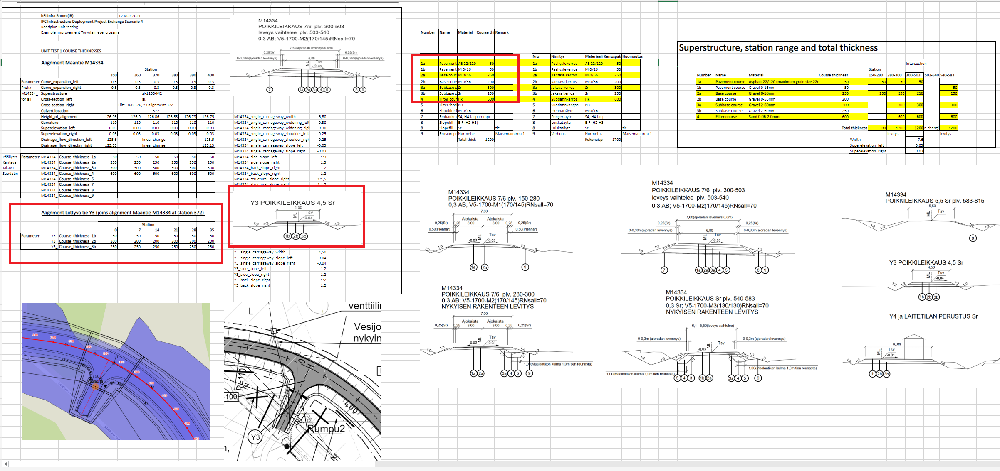

## Model Dataset

This test case utilizes the following dataset.

- The alignment layout according to [ALIN06](../ALIN06)
- Pavement structures located along the alignment geometry
- Pavement assembled by courses
- Materials and properties associated with pavement and courses 

| Filename                                                     | Description                                   |
| ------------------------------------------------------------ | --------------------------------------------- |
| [HorizontalAlignmentParameters](./HorizontalAlignmentParameters.csv) | Parameters for the horizontal segments as csv |
| [VerticalAlignmentParameters](./VerticalAlignmentParameters.csv) | Parameters for the vertical segments as csv   |
| [LandXML](./TOI-M14334-0000A.xml)                            | LandXML-file representing the alignment       |
| [Pavement composition](Pavement-composition.png)             | Image showing the composition of the pavement |

## Dataset specification

### Entities table

| **Element**            | **Attribute**  | **Value**          | **Notes**   |
| ---------------------- | -------------- | ------------------ | ----------- |
| IfcProject             | Name           | ASPC               |             |
| IfcSite                | Name           | ASPC.Site          |             |
| IfcAlignment           | Name           | A1                 | From ALIN06 |
| IfcRoad                | Name           | ASPC.Road          |             |
| IfcAlignmentHorizontal | Name           | AH1                | From ALIN06 |
| IfcAlignmentVertical   | Name           | AV1                | From ALIN06 |
| IfcPavementType        | Name           | PT1                |             |
|                        | PredefinedType | FLEXIBLE           |             |
| IfcPavement            | Name           | P1                 |             |
| IfcPavement            | Name           | P2                 |             |
| IfcCourseType          | Name           | CT1                |             |
|                        | PredefinedType | USERDEFINED        |             |
|                        | ObjectType     | PAVING             |             |
| IfcCourseType          | Name           | CT2                |             |
|                        | PredefinedType | USERDEFINED        |             |
|                        | ObjectType     | BASECOURSE         |             |
| IfcCourseType          | Name           | CT3                |             |
|                        | PredefinedType | USERDEFINED        |             |
|                        | ObjectType     | SUBBASECOURSE      |             |
| IfcCourseType          | Name           | CT4                |             |
|                        | PredefinedType | USERDEFINED        |             |
|                        | ObjectType     | FILTERCOURSE       |             |
| IfcCourseType          | Name           | CT5                |             |
|                        | PredefinedType | USERDEFINED        |             |
|                        | ObjectType     | SOFTSHOULDER_LEFT  |             |
| IfcCourseType          | Name           | CT6                |             |
|                        | PredefinedType | USERDEFINED        |             |
|                        | ObjectType     | SOFTSHOULDER_RIGHT |             |
| IfcCourse              | Name           | C1                 |             |
| IfcCourse              | Name           | C2                 |             |
| IfcCourse              | Name           | C3                 |             |
| IfcCourse              | Name           | C4                 |             |
| IfcCourse              | Name           | C5                 |             |
| IfcCourse              | Name           | C6                 |             |
| IfcCourse              | Name           | C7                 |             |
| IfcCourse              | Name           | C8                 |             |
| IfcCourse              | Name           | C9                 |             |
| IfcCourse              | Name           | C10                |             |
| IfcCourse              | Name           | C11                |             |
| IfcCourse              | Name           | C12                |             |

### Properties table

| **Entity**      | **Entity Type** | Entity Name | **PropertySet Name** | **Property Name**   | **Property Value Type**     | **Enumerated Values** | **Value type**         | **Property Value** |
| --------------- | --------------- | ----------- | -------------------- | ------------------- | --------------------------- | --------------------- | ---------------------- | ------------------ |
| IfcPavementType | FLEXIBLE        | PT1         | Pset_PavementCommon  | NominalThickness    | IfcNonNegativeLengthMeasure |                       | IfcPropertySingleValue | 1,20               |
|                 |                 |             |                      | StructuralSlope     | IfcPositiveRatioMeasure     |                       | IfcPropertySingleValue | 0,666666667        |
|                 |                 |             |                      | StructuralSlopeType | IfcLabel                    |                       | IfcPropertySingleValue | EVEN               |
| IfcPavement     |                 | P1          | Pset_PavementCommon  | NominalWidth        | IfcNonNegativeLengthMeasure |                       | IfcPropertySingleValue | 6,8                |
|                 |                 |             |                      | NominalLength       | IfcNonNegativeLengthMeasure |                       | IfcPropertySingleValue | 16,82              |
| IfcPavement     |                 | P2          | Pset_PavementCommon  | NominalWidth        | IfcNonNegativeLengthMeasure |                       | IfcPropertySingleValue | 7,4                |
|                 |                 |             |                      | NominalLength       | IfcNonNegativeLengthMeasure |                       | IfcPropertySingleValue | 26,18              |
| IfcCourseType   | USERDEFINED     | CT1         | Pset_CourseCommon    | NominalThickness    | IfcNonNegativeLengthMeasure |                       | IfcPropertySingleValue | 0,05               |
| IfcCourseType   | USERDEFINED     | CT2         | Pset_CourseCommon    | NominalThickness    | IfcNonNegativeLengthMeasure |                       | IfcPropertySingleValue | 0,25               |
| IfcCourseType   | USERDEFINED     | CT3         | Pset_CourseCommon    | NominalThickness    | IfcNonNegativeLengthMeasure |                       | IfcPropertySingleValue | 0,30               |
| IfcCourseType   | USERDEFINED     | CT4         | Pset_CourseCommon    | NominalThickness    | IfcNonNegativeLengthMeasure |                       | IfcPropertySingleValue | 0,60               |
| IfcCourseType   | USERDEFINED     | CT5         | Pset_CourseCommon    | NominalThickness    | IfcNonNegativeLengthMeasure |                       | IfcPropertySingleValue | 0,05               |
| IfcCourseType   | USERDEFINED     | CT6         | Pset_CourseCommon    | NominalThickness    | IfcNonNegativeLengthMeasure |                       | IfcPropertySingleValue | 0,05               |

### Horizontal segments table

The horizontal segments are defined in ALIN06.

### Vertical segments table

The vertical segments are defined in ALIN06.

### Spatial (De)Composition table

| **Parent Element** | **Parent Element Type** | **Parent Element Name** | **MinSize** | **MaxSize** | **Child Element** | **Child Element Type** | **Child Element Name** |
| ------------------ | ----------------------- | ----------------------- | ----------- | ----------- | ----------------- | ---------------------- | ---------------------- |
| IfcProject         |                         | ASPC                    | 1           | 1           | IfcSite           |                        | ASPC.Site              |
| IfcSite            |                         | ASPC.Site               | 1           | 1           | IfcRoad           |                        | ASPC.Road              |

### Spatial Containment table

| **Spatial Element** | **Spatial Element Type** | **Spatial Element Name** | **MinSize** | **MaxSize** | **Element**  | **Element Type** | **Element Name** |
| ------------------- | ------------------------ | ------------------------ | ----------- | ----------- | ------------ | ---------------- | ---------------- |
| IfcSite             |                          | ASPC.Site                | 1           | 1           | IfcAlignment |                  | A1               |
| IfcRoad             |                          | ASPC.Road                | 2           | 2           | IfcPavement  | FLEXIBLE         |                  |

### Element (De)Composition Table

| **Assembly Element** | **Assembly Type** | **Assembly Name** | **MinSize** | **MaxSize** | **Element** | **Element Type** | **Element Name** |
| -------------------- | ----------------- | ----------------- | ----------- | ----------- | ----------- | ---------------- | ---------------- |
| IfcPavement          | FLEXIBLE          | P1                | 1           | 1           | IfcCourse   |                  | C1               |
| IfcPavement          | FLEXIBLE          | P1                | 1           | 1           | IfcCourse   |                  | C2               |
| IfcPavement          | FLEXIBLE          | P1                | 1           | 1           | IfcCourse   |                  | C3               |
| IfcPavement          | FLEXIBLE          | P1                | 1           | 1           | IfcCourse   |                  | C4               |
| IfcPavement          | FLEXIBLE          | P1                | 1           | 1           | IfcCourse   |                  | C5               |
| IfcPavement          | FLEXIBLE          | P1                | 1           | 1           | IfcCourse   |                  | C6               |
| IfcPavement          | FLEXIBLE          | P2                | 1           | 1           | IfcCourse   |                  | C7               |
| IfcPavement          | FLEXIBLE          | P2                | 1           | 1           | IfcCourse   |                  | C8               |
| IfcPavement          | FLEXIBLE          | P2                | 1           | 1           | IfcCourse   |                  | C9               |
| IfcPavement          | FLEXIBLE          | P2                | 1           | 1           | IfcCourse   |                  | C10              |
| IfcPavement          | FLEXIBLE          | P2                | 1           | 1           | IfcCourse   |                  | C11              |
| IfcPavement          | FLEXIBLE          | P2                | 1           | 1           | IfcCourse   |                  | C12              |

**NOTE**:

- when **MinSize** and **MaxSize** have the same value, it means exactly. Example: MinSize=MaxSize=1, means that the Assembly must aggregates exactly 1 Element with that Type (and Name).

### Object Types Table

| **Entity Type** | **Entity Type Name** | **MinSize** | **MaxSize** | **IfcObject** | **IfcObject Name** |
| --------------- | -------------------- | ----------- | ----------- | ------------- | ------------------ |
| IfcPavementType | PT1                  | 1           |             | IfcPavement   | P1                 |
| IfcPavementType | PT1                  | 1           |             | IfcPavement   | P2                 |
| IfcCourseType   | CT1                  | 1           |             | IfcCourse     | C1                 |
| IfcCourseType   | CT1                  | 1           |             | IfcCourse     | C7                 |
| IfcCourseType   | CT2                  | 1           |             | IfcCourse     | C2                 |
| IfcCourseType   | CT2                  | 1           |             | IfcCourse     | C8                 |
| IfcCourseType   | CT3                  | 1           |             | IfcCourse     | C3                 |
| IfcCourseType   | CT3                  | 1           |             | IfcCourse     | C9                 |
| IfcCourseType   | CT4                  | 1           |             | IfcCourse     | C4                 |
| IfcCourseType   | CT4                  | 1           |             | IfcCourse     | C10                |
| IfcCourseType   | CT5                  | 1           |             | IfcCourse     | C5                 |
| IfcCourseType   | CT5                  | 1           |             | IfcCourse     | C11                |
| IfcCourseType   | CT6                  | 1           |             | IfcCourse     | C6                 |
| IfcCourseType   | CT6                  | 1           |             | IfcCourse     | C12                |

**NOTE**:

- when **Minimum** and **Maximum** have the same value, it means exactly. Example: Minimum=Maximum=1, means that the entity type must type exactly 1 object with that Name.
- when **Maximum is empty**, it means **unlimited**. Example: Minimum=1; Maximum=empty, means that the Entity Type must type 1 or more Object of the requested name.

### Material Association Table

| **Object**    | **Object Name** | **Material Definition** | **Material Name** |
| ------------- | --------------- | ----------------------- | ----------------- |
| IfcCourseType | CT1             | IfcMaterial             | Asphalt 22/120    |
| IfcCourseType | CT2             | IfcMaterial             | Gravel 0/56       |
| IfcCourseType | CT3             | IfcMaterial             | Gravel  2/20      |
| IfcCourseType | CT4             | IfcMaterial             | Sand  0.06/2      |
| IfcCourseType | CT5             | IfcMaterial             | Gravel  0/16      |
| IfcCourseType | CT6             | IfcMaterial             | Gravel  0/16      |

### Product Geometric Representation table

| **Product**            | **Product Type** | **Product Name** | **Representation Identifier** | **Representation Type** | **Items**                   |
| ---------------------- | ---------------- | ---------------- | ----------------------------- | ----------------------- | --------------------------- |
| IfcAlignment           | na               | A1               | Axis                          | Curve3D                 | 1 IfcGradientCurve          |
| IfcAlignmentHorizontal | na               | AH1              | Axis                          | Curve2D                 | 1 IfcCompositeCurve         |
| IfcAlignmentVertical   | na               | AV1              | Axis                          | Curve2D                 | 1 IfcGradientCurve          |
| IfcCourse              |                  | All              | Axis                          | Curve3D                 | IfcIndexedPolyCurve         |
| IfcCourse              |                  | All              | Axis                          | Curve3D                 | IfcOffsetCurveByDistances   |
| IfcCourse              |                  | All              | Surface                       | Tesselation             | IfcTriangulatedFaceSet      |
| IfcCourse              |                  | All              | Body                          | AdvancedSweptSolid      | IfcSectionedSolidHorizontal |

The geometry of the different courses are specified in the following figures:

Note that the b alternatives are not used for this test.

The geometric representation for the individual courses in the pavement can be represented in the following ways:

**Axis/Curve3D alternative 1**

lkfdsjslfdkj

**Axis/Curve3D alternative 2**

lkfdsjslfdkj

**Surface/Tesselation**

lkfdsjslfdkj

**Body/AdvancedSweptSolid**

lkfdsjslfdkj

### Product Placement table

| **Product**  | **Product Type** | **Product Name** | **Object Placement**              | Relative Placement Product | Relative Placement Product Type | Relative Placement Product Name |
| ------------ | ---------------- | ---------------- | --------------------------------- | -------------------------- | ------------------------------- | ------------------------------- |
| IfcAlignment |                  | A1               | IfcLocalPlacement                 | IfcSite                    | na                              | Alin06.Site                     |
| IfcPavement  | FLEXIBLE         | P1               | IfcLinearPlacement at 315    | IfcAlignment               | na                              | A1                              |
| IfcPavement  | FLEXIBLE         | P2               | IfcLinearPlacement at 331,82 | IfcAlignment               | na                              | A1                              |
| IfcCourse    | USERDEFINED      | C1               |                                   |                            |                                 |                                 |
| IfcCourse    | USERDEFINED      | C2               |                                   |                            |                                 |                                 |
| IfcCourse    | USERDEFINED      | C3               |                                   |                            |                                 |                                 |
| IfcCourse    | USERDEFINED      | C4               |                                   |                            |                                 |                                 |
| IfcCourse    | USERDEFINED      | C5               |                                   |                            |                                 |                                 |
| IfcCourse    | USERDEFINED      | C6               |                                   |                            |                                 |                                 |
| IfcCourse    | USERDEFINED      | C7               |                                   |                            |                                 |                                 |
| IfcCourse    | USERDEFINED      | C8               |                                   |                            |                                 |                                 |
| IfcCourse    | USERDEFINED      | C0               |                                   |                            |                                 |                                 |
| IfcCourse    | USERDEFINED      | C10              |                                   |                            |                                 |                                 |
| IfcCourse    | USERDEFINED      | C11              |                                   |                            |                                 |                                 |
| IfcCourse    | USERDEFINED      | C12              |                                   |                            |                                 |                                 |

## Drawings (Visualisations)

The following Drawings and visualisations describe the test case dataset to be modelled and certified.

| Filename             | Description                                          |
| -------------------- | ---------------------------------------------------- |
| Pavement composition |  |

## Supporting files

| Filename                                                     | Description                                   |
| ------------------------------------------------------------ | --------------------------------------------- |
| [HorizontalAlignmentParameters](./HorizontalAlignmentParameters.csv) | Parameters for the horizontal segments as csv |
| [VerticalAlignmentParameters](./VerticalAlignmentParameters.csv) | Parameters for the vertical segments as csv   |
| [LandXML](./TOI-M14334-0000A.xml)                            | LandXML-file representing the alignment       |