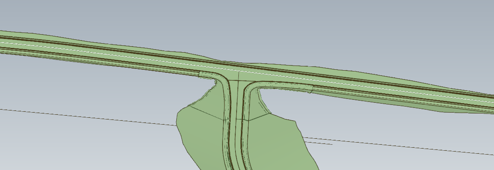
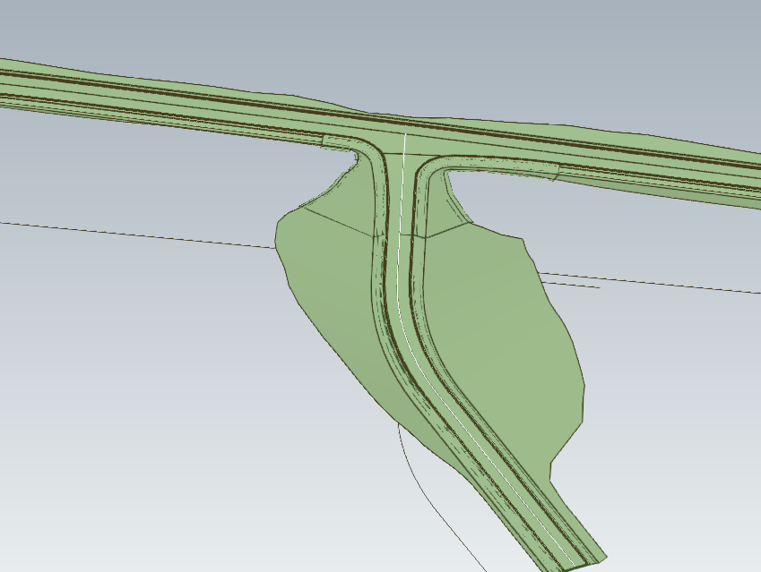
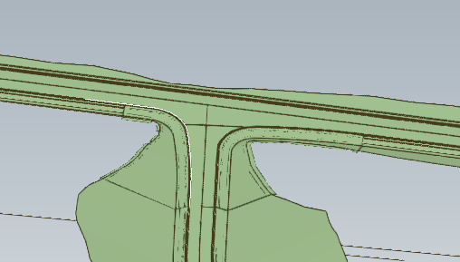
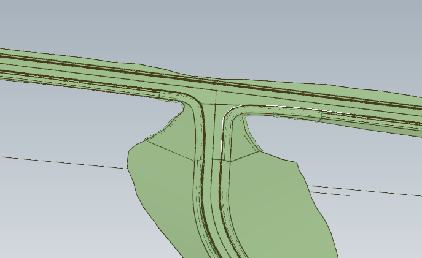
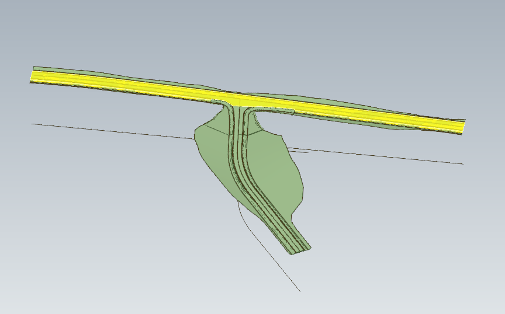
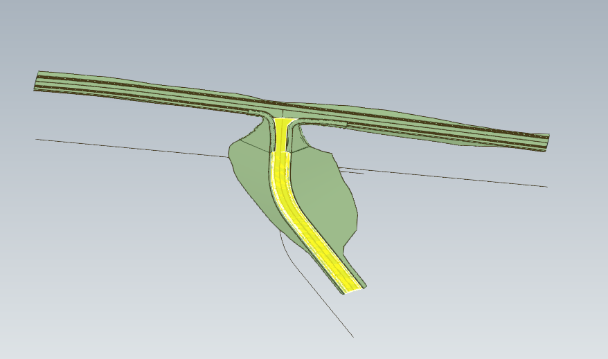
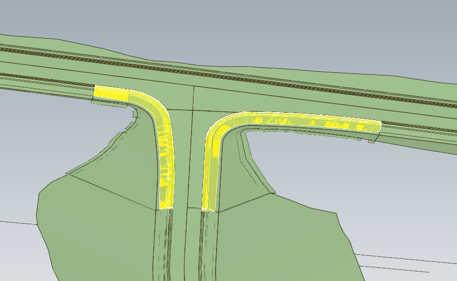
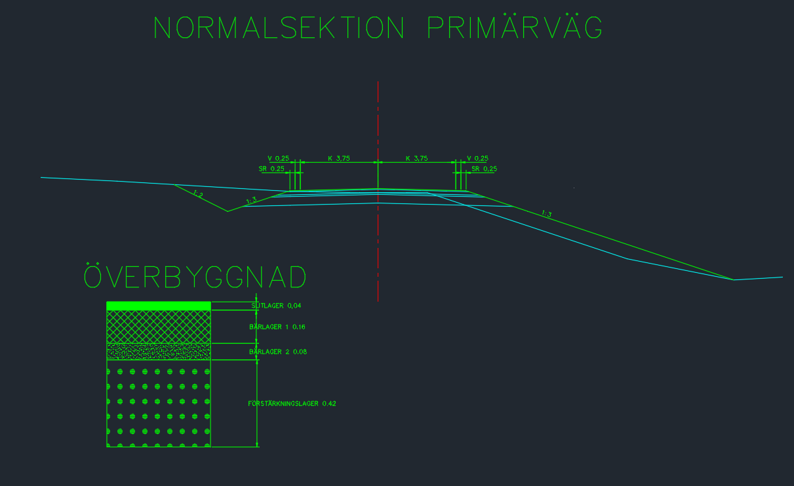
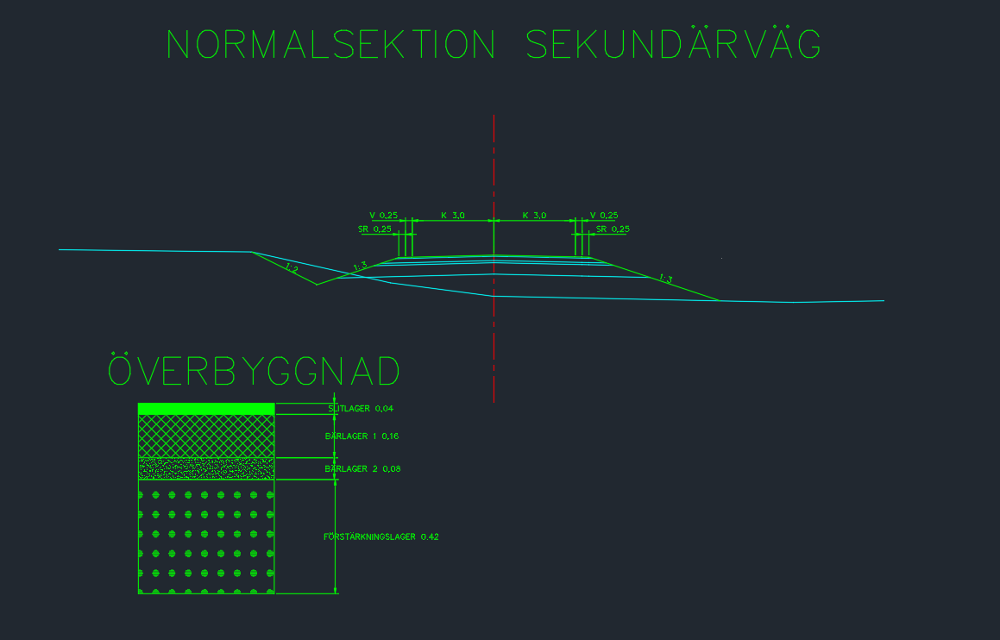

## Model Dataset

This test case utilizes the following dataset.

- A dataset including two intersecting roads in a T junction (a secondary road ending at and joining a primary road).

- The main alignments for the primary and the secondary roads

  
  *Primary Road - Alignment (white)*

  
  *Primary Road - Alignment (white)*

- Alignments for the pavement (roadway) edges where the two roads meet. 

  
  *Intersection - Alignment HVK (white)*

  
  *Intersection - Alignment VVK (white)*

- An alignment is defined to separate the pavements belonging to the primary road from the pavements belonging to the secondary road.

  
  *Intersection - Alignment Avgränsning (white)*

- For each road and the intersection, the pavements aggregates of a couple of courses that are represented by IfcFacetedBrep. 
  
  - These elements carry material and Psets
  
  - The pavement for the intersection represents the part outside the  roadway including the verge, support strip and inner slope (excluding slope fill)
  
    
    *Primary Road - Pavement (Yellow)*
  
    
    *Secondary Road - Pavement (Yellow)*
  
    
    *Intersection - Pavement (Yellow)*
  
- A spatial structure representing the breakdown of the junction project:

  - IfcProject
    - IfcSite
      - IfcAlignment (4)

      - IfcRoad (Primary Road)
        - IfcRoadPart/ROADSEGMENT
          - IfcPavement

      - IfcRoad (Secondary Road)
        - IfcRoadPart/INTERSECTION
          - IfcPavement

        - IfcRoadPart/ROADSEGMENT
          - IfcPavement

- The typical crossections for the roads have the following design:

  - Primary road:
    
    
    *Primary Road - typical cross section*
    
  - Secondary road:
    
    
    *Secondary Road - typical cross section*

| Filename                                                     | Description                                                  |
| ------------------------------------------------------------ | ------------------------------------------------------------ |
| [TRV.ifc](TRV.ifc)                                           | IFC Reference file provided by Trimble Solutions *NOTE: The file contains objects such as breaklines (IfcAnnotation), Cut (IfcEarthworksCut) and Fill (IfcEarthworksFill) which are not mandatory for this test instruction.* |
| [Typical cross section - primary & secondary roads](Typsektioner Primärväg och Sekundärväg.dwg) | DWG-file with typical cross section drawings                 |

## Dataset specification

### Entities table

| **Element**            | **Attribute**  | **Value**                              | **Notes**                                                    |
| ---------------------- | -------------- | -------------------------------------- | ------------------------------------------------------------ |
| IfcProject             | Name           | TRV                                    |                                                              |
| IfcSite                | Name           | TRV                                    |                                                              |
| IfcAlignment           | Name           | CL Primärväg                           | Centerline for primary road                                  |
| IfcAlignmentHorizontal | Name           | CL Primärväg \| Horizontal alignment   | Horizontal alignment primary road                            |
| IfcAlignmentVertical   | Name           | CL Primärväg \| Vertical alignment     | Vertical alignment primary road                              |
| IfcAlignment           | Name           | CL Sekundärväg                         | Centerline for secondary road                                |
| IfcAlignmentHorizontal | Name           | CL Sekundärväg \| Horizontal alignment |                                                              |
| IfcAlignmentVertical   | Name           | CL Sekundärväg \| Vertical alignment   |                                                              |
| IfcAlignment           | Name           | HVK                                    | Pavement edge connecting right edge of primary with left edge of secondary |
| IfcAlignmentHorizontal | Name           | HVK \| Horizontal alignment            |                                                              |
| IfcAlignmentVertical   | Name           | HVK \| Vertical alignment              |                                                              |
| IfcAlignment           | Name           | VVK                                    | Pavement edge connecting right edge of secondary with right edge of primary |
| IfcAlignmentHorizontal | Name           | VVK \| Horizontal alignment            |                                                              |
| IfcAlignmentVertical   | Name           | VVK \| Vertical alignment              |                                                              |
| IfcAlignment           | Name           | Avgränsning                            | Boundary line between primary and secondary roads            |
| IfcAlignmentHorizontal | Name           | Avgränsning \| Horizontal alignment    |                                                              |
| IfcAlignmentVertical   | Name           | Avgränsning \| Vertical alignment      |                                                              |
| IfcRoad                | Name           | Primärväg                              | Primary road                                                 |
| IfcRoadPart            | Name           | Primärväg \| ROADSEGMENT               | Primary road segment                                         |
|                        | PredefinedType | ROADSEGMENT                            |                                                              |
| IfcRoad                | Name           | Sekundärväg                            | Secondary road                                               |
| IfcRoadPart            | Name           | Sekundärväg \| ROADSEGMENT             | Secondary road segment                                       |
|                        | PredefinedType | ROADSEGMENT                            |                                                              |
| IfcRoadPart            | Name           | Sekundärväg \| INTERSECTION            | The junction                                                 |
|                        | PredefinedType | INTERSECTION                           |                                                              |
| IfcPavement            | Name           | Primärväg \| PAVEMENT                  | Pavement primary road                                        |
|                        | PredefinedType | RIGID                                  |                                                              |
| IfcCourse              | Name           | Primärväg \| Slitlager                 | Wearing course primary road                                  |
|                        | PredefinedType | USERDEFINED                            |                                                              |
|                        | ObjectType     | 'Paving'                               |                                                              |
| IfcCourse              | Name           | Primärväg \| Bärlager 1                | Binder course primary road                                   |
|                        | PredefinedType | 'USERDEFINED'                          |                                                              |
|                        | ObjectType     | 'BinderCourse'                         |                                                              |
| IfcCourse              | Name           | Primärväg \| Bärlager 2                | Base course primary road                                     |
|                        | PredefinedType | 'USERDEFINED'                          |                                                              |
|                        | ObjectType     | 'BaseCourse'                           |                                                              |
| IfcCourse              | Name           | Primärväg \| Först.lager 1             | Sub base course primary road                                 |
|                        | PredefinedType | 'USERDEFINED'                          |                                                              |
|                        | ObjectType     | 'SubBaseCourse'                        |                                                              |
| IfcPavement            | Name           | Sekundärväg \| PAVEMENT                | Pavement secondary road                                      |
|                        | PredefinedType | RIGID                                  |                                                              |
| IfcCourse              | Name           | Sekundärväg \| Slitlager               | Wearing course secondary road                                |
|                        | PredefinedType | USERDEFINED                            |                                                              |
|                        | ObjectType     | 'PAVING'                               |                                                              |
| IfcCourse              | Name           | Sekundärväg \| Bärlager 1              | Binder course secondary road                                 |
|                        | PredefinedType | 'USERDEFINED'                          |                                                              |
|                        | ObjectType     | 'BINDERCOURSE'                         |                                                              |
| IfcCourse              | Name           | Sekundärväg \| Bärlager 2              | Base course secondary road                                   |
|                        | PredefinedType | 'USERDEFINED'                          |                                                              |
|                        | ObjectType     | 'BASECOURSE'                           |                                                              |
| IfcCourse              | Name           | Sekundärväg \| Först.lager 1           | Sub base course secondary road                               |
|                        | PredefinedType | 'USERDEFINED'                          |                                                              |
|                        | ObjectType     | 'SUBBASECOURSE'                        |                                                              |
| IfcPavement            | Name           | Slänt \| PAVEMENT                      | Pavement sight slope intersection                            |
|                        | PredefinedType | RIGID                                  |                                                              |
| IfcCourse              | Name           | H slänt \| Först.lager 1               | Sub base course right slope intersection                     |
|                        | PredefinedType | USERDEFINED                            |                                                              |
|                        | ObjectType     | 'SUBBASECOURSE_RIGHT'                  |                                                              |
| IfcCourse              | Name           | H slänt \| Bärlager 2                  | Base course right slope intersection                         |
|                        | PredefinedType | USERDEFINED                            |                                                              |
|                        | ObjectType     | 'BASECOURSE_RIGHT'                     |                                                              |
| IfcCourse              | Name           | H slänt \| Bärlager 1                  | Binder course right slope intersection                       |
|                        | PredefinedType | USERDEFINED                            |                                                              |
|                        | ObjectType     | 'BINDERCOURSE_RIGHT'                   |                                                              |
| IfcCourse              | Name           | H-slänt \| Slitlager                   | Wearing course right slope intersection                      |
|                        | PredefinedType | USERDEFINED                            |                                                              |
|                        | ObjectType     | 'PAVING_RIGHT'                         |                                                              |
| IfcCourse              | Name           | V slänt \| Först.lager 1               | Sub base course left slope intersection                      |
|                        | PredefinedType | USERDEFINED                            |                                                              |
|                        | ObjectType     | 'SUBBASECOURSE_LEFT'                   |                                                              |
| IfcCourse              | Name           | V slänt \| Bärlager 2                  | Base course left slope intersection                          |
|                        | PredefinedType | USERDEFINED                            |                                                              |
|                        | ObjectType     | 'BASECOURSE_LEFT'                      |                                                              |
| IfcCourse              | Name           | V slänt \| Bärlager 1                  | Binder course left slope intersection                        |
|                        | PredefinedType | USERDEFINED                            |                                                              |
|                        | ObjectType     | 'BINDERCOURSE_LEFT'                    |                                                              |
| IfcCourse              | Name           | V-slänt \| Slitlager                   | Wearing course left slope intersection                       |
|                        | PredefinedType | USERDEFINED                            |                                                              |
|                        | ObjectType     | 'PAVING_LEFT'                          |                                                              |

### Properties table

| **Entity**  | **Entity Type** | Entity Name                  | **PropertySet Name** | **Property Name**   | **Property Value Type**     | **Enumerated Values** | **Value type**         | **Property Value** |
| ----------- | --------------- | ---------------------------- | -------------------- | ------------------- | --------------------------- | --------------------- | ---------------------- | ------------------ |
| IfcPavement | RIGID           | Primärväg \| PAVEMENT        | Pset_PavementCommon  | NominalThickness    | IfcNonNegativeLengthMeasure |                       | IfcPropertySingleValue | 0,7                |
|             |                 |                              |                      | NominalWidth        | IfcNonNegativeLengthMeasure |                       | IfcPropertySingleValue | 7,5                |
|             |                 |                              |                      | StructuralSlope     | IfcPositiveRatioMeasure     |                       | IfcPropertySingleValue |                    |
|             |                 |                              |                      | StructuralSlopeType | IfcLabel                    |                       | IfcPropertySingleValue | EVEN               |
| IfcPavement | RIGID           | Sekundärväg \| PAVEMENT      | Pset_PavementCommon  | NominalThickness    | IfcNonNegativeLengthMeasure |                       | IfcPropertySingleValue | 0,7                |
|             |                 |                              |                      | NominalWidth        | IfcNonNegativeLengthMeasure |                       | IfcPropertySingleValue | 6                  |
|             |                 |                              |                      | StructuralSlope     | IfcPositiveRatioMeasure     |                       | IfcPropertySingleValue |                    |
|             |                 |                              |                      | StructuralSlopeType | IfcLabel                    |                       | IfcPropertySingleValue | EVEN               |
| IfcPavement | RIGID           | Slänt\| PAVEMENT             | Pset_PavementCommon  | StructuralSlope     | IfcPositiveRatioMeasure     |                       | IfcPropertySingleValue | 0,3333 (-1:3)      |
|             |                 |                              |                      | StructuralSlopeType | IfcLabel                    |                       | IfcPropertySingleValue | EVEN               |
| IfcCourse   | USERDEFINED     | Primärväg \| Slitlager       | Pset_CourseCommon    | NominalThickness    | IfcNonNegativeLengthMeasure |                       | IfcPropertySingleValue | 0,04               |
| IfcCourse   | USERDEFINED     | Primärväg \| Bärlager 1      | Pset_CourseCommon    | NominalThickness    | IfcNonNegativeLengthMeasure |                       | IfcPropertySingleValue | 0,16               |
| IfcCourse   | USERDEFINED     | Primärväg \| Bärlager 2      | Pset_CourseCommon    | NominalThickness    | IfcNonNegativeLengthMeasure |                       | IfcPropertySingleValue | 0,08               |
| IfcCourse   | USERDEFINED     | Primärväg \| Först.lager 1   | Pset_CourseCommon    | NominalThickness    | IfcNonNegativeLengthMeasure |                       | IfcPropertySingleValue | 0,42               |
| IfcCourse   | USERDEFINED     | Sekundärväg \| Slitlager     | Pset_CourseCommon    | NominalThickness    | IfcNonNegativeLengthMeasure |                       | IfcPropertySingleValue | 0,04               |
| IfcCourse   | USERDEFINED     | Sekundärväg \| Bärlager 1    | Pset_CourseCommon    | NominalThickness    | IfcNonNegativeLengthMeasure |                       | IfcPropertySingleValue | 0,16               |
| IfcCourse   | USERDEFINED     | Sekundärväg \| Bärlager 2    | Pset_CourseCommon    | NominalThickness    | IfcNonNegativeLengthMeasure |                       | IfcPropertySingleValue | 0,08               |
| IfcCourse   | USERDEFINED     | Sekundärväg \| Först.lager 1 | Pset_CourseCommon    | NominalThickness    | IfcNonNegativeLengthMeasure |                       | IfcPropertySingleValue | 0,42               |

### Horizontal segments table

#### CL Primärväg

| Entity                        | PredefinedType | Name | Start Point X    | Start Point Y    | Start Direction   | Start Radius Of Curvature | End Radius Of Curvature | Segment Length   | Gravity Center Line Height |
| ----------------------------- | -------------- | ---- | ---------------- | ---------------- | ----------------- | ------------------------- | ----------------------- | ---------------- | -------------------------- |
| IfcAlignmentHorizontalSegment | LINE           | H1   | 139833.203261246 | 6469858.56013579 | 0.579675593256439 | 0                         | 0                       | 310.822584537187 |                            |

#### CL Sekundärväg

| Entity                        | PredefinedType | Name | Start Point X    | Start Point Y    | Start Direction | Start Radius Of Curvature | End Radius Of Curvature | Segment Length   | Gravity Center Line Height |
| ----------------------------- | -------------- | ---- | ---------------- | ---------------- | --------------- | ------------------------- | ----------------------- | ---------------- | -------------------------- |
| IfcAlignmentHorizontalSegment | LINE           | H1   | 139958.797789676 | 6469940.78736059 | -0.874043675285 | 0                         | 0                       | 56.6248338063507 |                            |
| IfcAlignmentHorizontalSegment | CIRCULARARC    | H2   | 139995.135677443 | 6469897.36006829 | -0.874043675305 | 100                       | 100                     | 49.5402294334664 |                            |
| IfcAlignmentHorizontalSegment | LINE           | H3   | 140034.862849863 | 6469868.61635507 | -0.378641380952 | 0                         | 0                       | 77.3984706373987 |                            |

#### HVK

| Entity                        | PredefinedType | Name | Start Point X    | Start Point Y    | Start Direction | Start Radius Of Curvature | End Radius Of Curvature | Segment Length   | Gravity Center Line Height |
| ----------------------------- | -------------- | ---- | ---------------- | ---------------- | --------------- | ------------------------- | ----------------------- | ---------------- | -------------------------- |
| IfcAlignmentHorizontalSegment | LINE           | H1   | 139935.654422533 | 6469921.15349706 | 0.579672188     | 0                         | 0                       | 17.134994187288  |                            |
| IfcAlignmentHorizontalSegment | CIRCULARARC    | H2   | 139949.99028268  | 6469930.53918508 | 0.579672188     | -10                       | -10                     | 13.0724741123582 |                            |
| IfcAlignmentHorizontalSegment | CIRCULARARC    | H3   | 139962.118387677 | 6469929.64065475 | -0.7275752223   | -150                      | -150                    | 21.9666509121467 |                            |
| IfcAlignmentHorizontalSegment | LINE           | H4   | 139977.396469904 | 6469913.88463349 | -0.8740195618   | 0                         | 0                       | 8.08031568722803 |                            |

#### VVK

| Entity                        | PredefinedType | Name | Start Point X    | Start Point Y    | Start Direction | Start Radius Of Curvature | End Radius Of Curvature | Segment Length   | Gravity Center Line Height |
| ----------------------------- | -------------- | ---- | ---------------- | ---------------- | --------------- | ------------------------- | ----------------------- | ---------------- | -------------------------- |
| IfcAlignmentHorizontalSegment | LINE           | H1   | 140002.585502546 | 6469964.97271748 | -2.5619116706   | 0                         | 0                       | 11.361703499456  |                            |
| IfcAlignmentHorizontalSegment | CIRCULARARC    | H2   | 139993.079876058 | 6469958.74926414 | -2.5619116706   | 150                       | 150                     | 25.3830089708276 |                            |
| IfcAlignmentHorizontalSegment | CIRCULARARC    | H3   | 139973.118297448 | 6469943.1192765  | -2.3926916107   | 10                        | 10                      | 15.1862667100601 |                            |
| IfcAlignmentHorizontalSegment | LINE           | H4   | 139972.257202024 | 6469929.37775854 | -0.87406493984  | 0                         | 0                       | 22.6120208199987 |                            |

#### Avgränsning

| Entity                        | PredefinedType | Name | Start Point X    | Start Point Y    | Start Direction | Start Radius Of Curvature | End Radius Of Curvature | Segment Length   | Gravity Center Line Height |
| ----------------------------- | -------------- | ---- | ---------------- | ---------------- | --------------- | ------------------------- | ----------------------- | ---------------- | -------------------------- |
| IfcAlignmentHorizontalSegment | LINE           | H1   | 139959.793067416 | 6469931.18896388 | 0.6967526514985 | 0                         | 0                       | 14.9519070168026 |                            |

### Vertical segments table

#### CL Primärväg

| Entity                      | PredefinedType   | Name | Start Dist Along | Horizontal Length | Start Height | Start Gradient | End Gradient | RadiusOfCurvature |
|-----------------------------|------------------|------|------------------|-------------------|--------------|----------------|--------------|-------------------|
| IfcAlignmentVerticalSegment | CONSTANTGRADIENT | V1   | -2.86918035354574 | 11.3362283677065 | 43.8287442117484 | 0.01768316987461 | 0.01768316987461 |                   |
| IfcAlignmentVerticalSegment | CIRCULARARC      | V2   | 8.46704801416078 | 58.291426785537 | 44.029204663712 | 0.01768316987461 | -0.04064455142376 | 1000           |
| IfcAlignmentVerticalSegment | CONSTANTGRADIENT | V3   | 66.7584747996978 | 245.375274687582 | 43.3605474566199 | -0.04064455142376 | -0.04064455142376 |                   |

#### CL Sekundärväg

| Entity                      | PredefinedType   | Name | Start Dist Along | Horizontal Length | Start Height     | Start Gradient    | End Gradient      | RadiusOfCurvature |
| --------------------------- | ---------------- | ---- | ---------------- | ----------------- | ---------------- | ----------------- | ----------------- | ----------------- |
| IfcAlignmentVerticalSegment | CONSTANTGRADIENT | V1   | 0                | 60.1176036877787  | 39.9724685152047 | -0.02957736251341 | -0.0295773625134  |                   |
| IfcAlignmentVerticalSegment | CIRCULARARC      | V2   | 60.1176036877787 | 45.1196010683822  | 38.1943483574936 | -0.0295773625134  | -0.01452609884898 | 3000              |
| IfcAlignmentVerticalSegment | CONSTANTGRADIENT | V3   | 105.237204756161 | 78.326329121072   | 37.199439385708  | -0.01452609884898 | -0.01452609884898 |                   |

#### HVK

| Entity                      | PredefinedType   | Name | Start Dist Along | Horizontal Length | Start Height     | Start Gradient   | End Gradient     | RadiusOfCurvature |
| --------------------------- | ---------------- | ---- | ---------------- | ----------------- | ---------------- | ---------------- | ---------------- | ----------------- |
| IfcAlignmentVerticalSegment | CONSTANTGRADIENT | V1   | 0                | 17.0093359641945  | 41.1028243446344 | -0.0406687282842 | -0.0406687282842 |                   |
| IfcAlignmentVerticalSegment | CIRCULARARC      | V2   | 17.0093359641945 | 2.01953976349906  | 40.4110762820115 | -0.0406687282842 | -0.0609433962264 | 100               |
| IfcAlignmentVerticalSegment | CONSTANTGRADIENT | V3   | 19.0288757276935 | 6.19984095334127  | 40.3084819350818 | -0.0609433962264 | -0.0609433962264 |                   |
| IfcAlignmentVerticalSegment | CIRCULARARC      | V4   | 25.2287166810348 | 10.3938214493299  | 39.9306425713216 | -0.0609433962264 | -0.0261934451491 | 300               |
| IfcAlignmentVerticalSegment | CONSTANTGRADIENT | V5   | 35.6225381303647 | 24.5837265955189  | 39.4779365943157 | -0.0261934451491 | -0.0261934451491 |                   |

#### VVK

| Entity                      | PredefinedType   | Name | Start Dist Along  | Horizontal Length | Start Height     | Start Gradient   | End Gradient     | RadiusOfCurvature |
| --------------------------- | ---------------- | ---- | ----------------- | ----------------- | ---------------- | ---------------- | ---------------- | ----------------- |
| IfcAlignmentVerticalSegment | CONSTANTGRADIENT | V1   | -1.39931742150553 | 39.7619971894627  | 37.8075452878682 | 0.0395168864245  | 0.0395168864245  |                   |
| IfcAlignmentVerticalSegment | CIRCULARARC      | V2   | 38.3626797679572  | 11.7363124008115  | 39.3788156148173 | 0.0395168864245  | -0.0295639751476 | 170               |
| IfcAlignmentVerticalSegment | CONSTANTGRADIENT | V3   | 50.0989921687687  | 24.8386046012662  | 39.4371512577256 | -0.0295639751476 | -0.0295639751476 |                   |

#### Avgränsning

| Entity                      | PredefinedType   | Name | Start Dist Along | Horizontal Length | Start Height     | Start Gradient   | End Gradient     | RadiusOfCurvature |
| --------------------------- | ---------------- | ---- | ---------------- | ----------------- | ---------------- | ---------------- | ---------------- | ----------------- |
| IfcAlignmentVerticalSegment | CONSTANTGRADIENT | V1   | -0.006910133504  | 5.30891707542168  | 39.8057259552131 | -0.0131041753938 | -0.0131041753938 |                   |
| IfcAlignmentVerticalSegment | CIRCULARARC      | V2   | 5.3020069419174  | 0.19000873308445  | 39.7361569747054 | -0.0131041753938 | -0.0321204806718 | 10                |
| IfcAlignmentVerticalSegment | CONSTANTGRADIENT | V3   | 5.49201567500192 | 9.47877199272593  | 39.7318608230988 | -0.0321204806718 | -0.0321204806718 |                   |

### Spatial (De)Composition table

| **Parent Element** | **Parent Element Type** | **Parent Element Name** | **MinSize** | **MaxSize** | **Child Element** | **Child Element Type** | **Child Element Name**      |
| ------------------ | ----------------------- | ----------------------- | ----------- | ----------- | ----------------- | ---------------------- | --------------------------- |
| IfcProject         |                         | TRV                     | 1           | 1           | IfcSite           |                        | TRV                         |
| IfcSite            |                         | TRV                     | 1           | 1           | IfcRoad           |                        | Primärväg                   |
| IfcRoad            |                         | Primärväg               | 1           | 1           | IfcRoadPart       | ROADSEGMENT            | Primärväg \| ROADSEGMENT    |
| IfcRoad            |                         | Sekundärväg             | 1           | 1           | IfcRoadPart       | ROADSEGMENT            | Sekundärväg \| ROADSEGMENT  |
| IfcRoad            |                         | Sekundärväg             | 1           | 1           | IfcRoadPart       | INTERSECTION           | Sekundärväg \| INTERSECTION |

### Spatial Containment table

| **Spatial Element** | **Spatial Element Type** | **Spatial Element Name**    | **MinSize** | **MaxSize** | **Element**  | **Element Type** | **Element Name**        |
| ------------------- | ------------------------ | --------------------------- | ----------- | ----------- | ------------ | ---------------- | ----------------------- |
| IfcSite             |                          | TRV                         | 1           | 1           | IfcAlignment |                  | CL Primärväg            |
| IfcSite             |                          | TRV                         | 1           | 1           | IfcAlignment |                  | CL Sekundärväg          |
| IfcSite             |                          | TRV                         | 1           | 1           | IfcAlignment |                  | HVK                     |
| IfcSite             |                          | TRV                         | 1           | 1           | IfcAlignment |                  | VVK                     |
| IfcSite             |                          | TRV                         | 1           | 1           | IfcAlignment |                  | Avgränsning             |
| IfcRoadPart         | ROADSEGMENT              | Primärväg \| ROADSEGMENT    | 1           | 1           | IfcPavement  | RIGID            | Primärväg \| PAVEMENT   |
| IfcRoadPart         | ROADSEGMENT              | Sekundärväg \| ROADSEGMENT  | 1           | 1           | IfcPavement  | RIGID            | Sekundärväg \| PAVEMENT |
| IfcRoadPart         | INTERSECTION             | Sekundärväg \| INTERSECTION | 1           | 1           | IfcPavement  | FLEXIBLE         | Slänt \| PAVEMENT       |

### Element (De)Composition Table

| **Assembly Element** | **Assembly Type** | **Assembly Name**       | **MinSize** | **MaxSize** | **Element** | **Element Type** | **Element Name**             |
| -------------------- | ----------------- | ----------------------- | ----------- | ----------- | ----------- | ---------------- | ---------------------------- |
| IfcPavement          | RIGID             | Primärväg \| PAVEMENT   | 1           | 1           | IfcCourse   |                  | Primärväg \| Slitlager       |
| IfcPavement          | RIGID             | Primärväg \| PAVEMENT   | 1           | 1           | IfcCourse   |                  | Primärväg \| Bärlager 1      |
| IfcPavement          | RIGID             | Primärväg \| PAVEMENT   | 1           | 1           | IfcCourse   |                  | Primärväg \| Bärlager 2      |
| IfcPavement          | RIGID             | Primärväg \| PAVEMENT   | 1           | 1           | IfcCourse   |                  | Primärväg \| Först.lager 1   |
| IfcPavement          | RIGID             | Sekundärväg \| PAVEMENT | 1           | 1           | IfcCourse   |                  | Sekundärväg \| Slitlager     |
| IfcPavement          | RIGID             | Sekundärväg \| PAVEMENT | 1           | 1           | IfcCourse   |                  | Sekundärväg \| Bärlager 1    |
| IfcPavement          | RIGID             | Sekundärväg \| PAVEMENT | 1           | 1           | IfcCourse   |                  | Sekundärväg \| Bärlager 2    |
| IfcPavement          | RIGID             | Sekundärväg \| PAVEMENT | 1           | 1           | IfcCourse   |                  | Sekundärväg \| Först.lager 1 |
| IfcPavement          | FLEXIBLE          | Slänt \| PAVEMENT       | 1           | 1           | IfcCourse   |                  | H slänt \| Slitlager         |
| IfcPavement          | FLEXIBLE          | Slänt \| PAVEMENT       | 1           | 1           | IfcCourse   |                  | V slänt \| Slitlager         |
| IfcPavement          | FLEXIBLE          | Slänt \| PAVEMENT       | 1           | 1           | IfcCourse   |                  | H slänt \| Bärlager 1        |
| IfcPavement          | FLEXIBLE          | Slänt \| PAVEMENT       | 1           | 1           | IfcCourse   |                  | V slänt \| Bärlager 1        |
| IfcPavement          | FLEXIBLE          | Slänt \| PAVEMENT       | 1           | 1           | IfcCourse   |                  | H slänt \| Bärlager 2        |
| IfcPavement          | FLEXIBLE          | Slänt \| PAVEMENT       | 1           | 1           | IfcCourse   |                  | V slänt \| Bärlager 2        |
| IfcPavement          | FLEXIBLE          | Slänt \| PAVEMENT       | 1           | 1           | IfcCourse   |                  | H slänt \| Först.lager 1     |
| IfcPavement          | FLEXIBLE          | Slänt \| PAVEMENT       | 1           | 1           | IfcCourse   |                  | V slänt \| Först.lager 1     |

**NOTE**:

- when **MinSize** and **MaxSize** have the same value, it means exactly. Example: MinSize=MaxSize=1, means that the Assembly must aggregates exactly 1 Element with that Type (and Name).

### Material Association Table

| **Object** | **Object Name**              | **Material Definition** | **Material Name** |
| ---------- | ---------------------------- | ----------------------- | ----------------- |
| IfcCourse  | Primärväg \| Slitlager       | IfcMaterial             | Asphalt           |
| IfcCourse  | Primärväg \| Bärlager 1      | IfcMaterial             | Asphalt           |
| IfcCourse  | Primärväg \| Bärlager 2      | IfcMaterial             | Asphalt           |
| IfcCourse  | Primärväg \| Först.lager 1   | IfcMaterial             | Crushed stone     |
| IfcCourse  | Sekundärväg \| Slitlager     | IfcMaterial             | Asphalt           |
| IfcCourse  | Sekundärväg \| Bärlager 1    | IfcMaterial             | Asphalt           |
| IfcCourse  | Sekundärväg \| Bärlager 2    | IfcMaterial             | Asphalt           |
| IfcCourse  | Sekundärväg \| Först.lager 1 | IfcMaterial             | Crushed stone     |

### Product Geometric Representation table

| **Product**            | **Product Type** | **Product Name** | **Representation Identifier** | **Representation Type** | **Items**         |
| ---------------------- | ---------------- | ---------------- | ----------------------------- | ----------------------- | ----------------- |
| IfcAlignment           | na               | All              | Axis                          | Curve3D                 | IfcGradientCurve  |
| IfcAlignmentHorizontal | na               | All              | Axis                          | Curve2D                 | IfcCompositeCurve |
| IfcAlignmentVertical   | na               | All              | Axis                          | Curve2D                 | IfcGradientCurve  |
| IfcCourse              | USERDEFINED      | All              | Body                          | Brep                    | IfcFacetedBrep    |

### Product Placement table 

| **Product**  | **Product Type** | **Product Name**             | **Object Placement** | Relative Placement Product | Relative Placement Product Type | Relative Placement Product Name |
| ------------ | ---------------- | ---------------------------- | -------------------- | -------------------------- | ------------------------------- | ------------------------------- |
| IfcAlignment |                  | CL Primärväg                 | IfcLocalPlacement    | IfcSite                    | na                              | TRV                             |
| IfcAlignment |                  | CL Sekundärväg               | IfcLocalPlacement    | IfcSite                    | na                              | TRV                             |
| IfcAlignment |                  | HVK                          | IfcLocalPlacement    | IfcSite                    | na                              | TRV                             |
| IfcAlignment |                  | VVK                          | IfcLocalPlacement    | IfcSite                    | na                              | TRV                             |
| IfcAlignment |                  | Avgränsning                  | IfcLocalPlacement    | IfcSite                    | na                              | TRV                             |
| IfcRoad      |                  | Primärväg                    | IfcLocalPlacement    | IfcSite                    | na                              | TRV                             |
| IfcRoad      |                  | Sekundärväg                  | IfcLocalPlacement    | IfcSite                    | na                              | TRV                             |
| IfcRoadPart  | ROADSEGMENT      | Primärväg \| ROADSEGMENT     | IfcLocalPlacement    | IfcRoad                    | na                              | Primärväg                       |
| IfcRoadPart  | INTERSECTION     | Sekundärväg \| INTERSECTION  | IfcLocalPlacement    | IfcRoad                    | na                              | Sekundärväg                     |
| IfcRoadPart  | ROADSEGMENT      | Sekundärväg \| ROADSEGMENT   | IfcLocalPlacement    | IfcRoad                    | na                              | Sekundärväg                     |
| IfcPavement  | RIGID            | Primärväg \| PAVEMENT        | IfcLocalPlacement    | IfcRoadPart                | ROADSEGMENT                     | Primärväg \| ROADSEGMENT        |
| IfcPavement  | RIGID            | Slänt \| PAVEMENT            | IfcLocalPlacement    | IfcRoadPart                | INTERSECTION                    | Sekundärväg \| INTERSECTION     |
| IfcPavement  | RIGID            | Sekundärväg \| PAVEMENT      | IfcLocalPlacement    | IfcRoadPart                | ROADSEGMENT                     | Sekundärväg \| ROADSEGMENT      |
| IfcCourse    | USERDEFINED      | Primärväg \| Slitlager       | IfcLocalPlacement    | IfcPavement                | RIGID                           | Primärväg \| PAVEMENT           |
| IfcCourse    | USERDEFINED      | Primärväg \| Bärlager 1      | IfcLocalPlacement    | IfcPavement                | RIGID                           | Primärväg \| PAVEMENT           |
| IfcCourse    | USERDEFINED      | Primärväg \| Bärlager 2      | IfcLocalPlacement    | IfcPavement                | RIGID                           | Primärväg \| PAVEMENT           |
| IfcCourse    | USERDEFINED      | Primärväg \| Först.lager 1   | IfcLocalPlacement    | IfcPavement                | RIGID                           | Primärväg \| PAVEMENT           |
| IfcCourse    | USERDEFINED      | H Slänt \| Slitlager         | IfcLocalPlacement    | IfcPavement                | RIGID                           | Slänt \| PAVEMENT               |
| IfcCourse    | USERDEFINED      | H Slänt \| Bärlager 1        | IfcLocalPlacement    | IfcPavement                | RIGID                           | Slänt \| PAVEMENT               |
| IfcCourse    | USERDEFINED      | H Slänt \| Bärlager 2        | IfcLocalPlacement    | IfcPavement                | RIGID                           | Slänt \| PAVEMENT               |
| IfcCourse    | USERDEFINED      | H Slänt \| Först.lager 1     | IfcLocalPlacement    | IfcPavement                | RIGID                           | Slänt \| PAVEMENT               |
| IfcCourse    | USERDEFINED      | V Slänt \| Slitlager         | IfcLocalPlacement    | IfcPavement                | RIGID                           | Slänt \| PAVEMENT               |
| IfcCourse    | USERDEFINED      | V Slänt \| Bärlager 1        | IfcLocalPlacement    | IfcPavement                | RIGID                           | Slänt \| PAVEMENT               |
| IfcCourse    | USERDEFINED      | V Slänt \| Bärlager 2        | IfcLocalPlacement    | IfcPavement                | RIGID                           | Slänt \| PAVEMENT               |
| IfcCourse    | USERDEFINED      | V Slänt \| Först.lager 1     | IfcLocalPlacement    | IfcPavement                | RIGID                           | Slänt \| PAVEMENT               |
| IfcCourse    | USERDEFINED      | Sekundärväg \| Slitlager     | IfcLocalPlacement    | IfcPavement                | RIGID                           | Sekundärväg \| PAVEMENT         |
| IfcCourse    | USERDEFINED      | Sekundärväg \| Bärlager 1    | IfcLocalPlacement    | IfcPavement                | RIGID                           | Sekundärväg \| PAVEMENT         |
| IfcCourse    | USERDEFINED      | Sekundärväg \| Bärlager 2    | IfcLocalPlacement    | IfcPavement                | RIGID                           | Sekundärväg \| PAVEMENT         |
| IfcCourse    | USERDEFINED      | Sekundärväg \| Först.lager 1 | IfcLocalPlacement    | IfcPavement                | RIGID                           | Sekundärväg \| PAVEMENT         |

## Drawings (Visualisations) 

The following Drawings and visualisations describe the test case dataset to be modelled and certified.

| Filename/Image                                               | Description                            |
| ------------------------------------------------------------ | -------------------------------------- |
| [Primary Road - Pavement.png](Primary Road - Pavement.png)   | Pavement - primary road                |
| [Secondary Road - Pavement.png](Secondary Road - Pavement.png) | Pavement - Secondary Road              |
| [Intersection - Pavement.png](Intersection - Pavement.png)   | Pavement - Intersection                |
| [Primary Road - Alignment.png](Primary Road - Alignment.png) | Alignment - Primary road               |
| [Secondary Road - Alignment.png](Secondary Road - Alignment.png) | Secondary road - alignment             |
| [Intersection - Alignment HVK.png](Intersection - Alignment HVK.png) | Intersection - Alignment HVK           |
| [Intersection - Alignment VVK.png](Intersection - Alignment VVK.png) | Intersection - Alignment VVK           |
| [Intersection - Alignment Avgränsning.png](Intersection - Alignment Avgränsning.png) | Intersection - Alignment Avgränsning   |
| [Primary Road - Typical cross section.png](Primary Road - Typical cross section.png) | Typical cross section - Primary Road   |
| [Secondary Road - Typical cross section.png](Secondary Road - Typical cross section.png) | Typical cross section - Secondary Road |

## Supporting files

| Filename           | Description                                                  |
| ------------------ | ------------------------------------------------------------ |
| [TRV.ifc](TRV.ifc) | IFC Reference file provided by Trimble Solutions *NOTE: The file contains objects such as breaklines (IfcAnnotation), cut (IfcEarthworksCut) and fill (IfcEarthworksFill) which are not mandatory for this test instruction.* |
