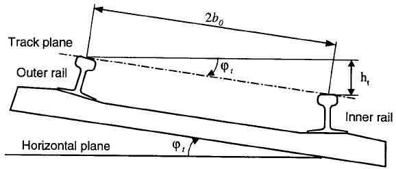

# Dataset description

| Documentation Code   | Test Title                        | Exchange Code | Test Code | Author          | Data Owner | Version | Date       |
|----------------------|-----------------------------------|---------------|-----------| ----------------|------------|---------|------------|
| IFC4.3AbRV_E1b_AL22  | (RFI) Two alignments with cant    | E1b (ALRC)    | AL22      | Evandro Alfieri | RFI        | 1.0     | DD.MM.YYYY |

## Model Dataset

This test case utilises the same dataset of the test IFC4.3AbRV_E1_AL22, with the addition of cant data.

| Filename                                             | Description                                                                                                         |
|------------------------------------------------------|---------------------------------------------------------------------------------------------------------------------|
| [Alignment1_cant](./Alignment1_cant.csv)             | [Alignment parameters for cant segments](#Alignment-parameters-for-cant-segments) of the Primary Route              |
| [Alignment2_cant](./Alignment2_cant.csv)             | [Alignment parameters for cant segments](#Alignment-parameters-for-cant-segments) of the Diverted Route             |

## Alignment parameters for cant segments

The cant layout of the alignment (both for Alignment 1 and Alignment 2) is described using a CSV file. The column headers match the IFC attributes for `IfcAlignmentCantSegment`. Refers to the standard's documentation for their description.

#### Alignment 1_Primary route

| Entity                  | PredefinedType   | Name | Start Dist Along | Horizontal Length | Start Cant left | End Cant left | Start Cant right | End Cant right |
|-------------------------|------------------|------|------------------|-------------------|-----------------|---------------|------------------|----------------|
| IfcAlignmentCantSegment | CONSTANTCANT     | C1   | 0                | 234.7194          | 0               | 0             | 0                | 0              |
| IfcAlignmentCantSegment | LINEARTRANSITION | C2   | 234.7194         | 40                | 0               | 0             | 0                | 0.06           |
| IfcAlignmentCantSegment | CONSTANTCANT     | C3   | 274.7194         | 193.4645          | 0               | 0             | 0.06             | 0.06           |
| IfcAlignmentCantSegment | LINEARTRANSITION | C4   | 468.1839         | 40                | 0               | 0             | 0.06             | 0              |
| IfcAlignmentCantSegment | CONSTANTCANT     | C5   | 508.1839         | 38.9815           | 0               | 0             | 0                | 0              |
| IfcAlignmentCantSegment | LINEARTRANSITION | C6   | 547.1654         | 40                | 0               | 0.06          | 0                | 0              |
| IfcAlignmentCantSegment | CONSTANTCANT     | C7   | 587.1654         | 109.4317          | 0.06            | 0.06          | 0                | 0              |
| IfcAlignmentCantSegment | LINEARTRANSITION | C8   | 696.5971         | 40                | 0.06            | 0             | 0                | 0              |
| IfcAlignmentCantSegment | CONSTANTCANT     | C9   | 736.5971         | 139.7711          | 0               | 0             | 0                | 0              |
| IfcAlignmentCantSegment | CONSTANTCANT     | C10  | 876.3682         | 876.3682          | 0               | 0             | 0                | 0              |

#### Alignment 2_Diverted route

| Entity                  | PredefinedType   | Name | Start Dist Along | Horizontal Length | Start Cant left | End Cant left | Start Cant right | End Cant right |
|-------------------------|------------------|------|------------------|-------------------|-----------------|---------------|------------------|----------------|
| IfcAlignmentCantSegment | CONSTANTCANT     | C1   | 0                | 22.9021           | 0               | 0             | 0                | 0              |
| IfcAlignmentCantSegment | CONSTANTCANT     | C2   | 22.9021          | 7.9355            | 0               | 0             | 0                | 0              |
| IfcAlignmentCantSegment | CONSTANTCANT     | C3   | 30.8376          | 68.2969           | 0               | 0             | 0                | 0              |
| IfcAlignmentCantSegment | LINEARTRANSITION | C4   | 99.1345          | 40                | 0               | 0             | 0                | 0.01           |
| IfcAlignmentCantSegment | CONSTANTCANT     | C5   | 139.1345         | 285.2424          | 0               | 0             | 0.01             | 0.01           |
| IfcAlignmentCantSegment | LINEARTRANSITION | C6   | 424.3769         | 40                | 0               | 0             | 0.01             | 0              |
| IfcAlignmentCantSegment | CONSTANTCANT     | C7   | 464.3769         | 36.9088           | 0               | 0             | 0                | 0              |
| IfcAlignmentCantSegment | LINEARTRANSITION | C8   | 501.2857         | 39.6989           | 0               | 0.01          | 0                | 0              |
| IfcAlignmentCantSegment | CONSTANTCANT     | C9   | 540.9846         | 107.4914          | 0.01            | 0.01          | 0                | 0              |
| IfcAlignmentCantSegment | LINEARTRANSITION | C10  | 648.476          | 39.6989           | 0.01            | 0             | 0                | 0              |
| IfcAlignmentCantSegment | CONSTANTCANT     | C11  | 688.1749         | 139.9216          | 0               | 0             | 0                | 0              |
| IfcAlignmentCantSegment | CONSTANTCANT     | C12  | 828.0965         | 828.0965          | 0               | 0             | 0                | 0              |

**NOTE**:
- In Italy, only linear transitions are used for cant
- All distances are in meters
- Applied cant: in a cross-section plane, orthogonal to the track axis, it is the difference in height (ht in the picture below) between two points, of the track plane, that have a conventional distance between them of 1500 mm. The cant is always applied to the external rail (the furthest rail from the center or the curve). Cant measure is positive because the external rail of a track is always higher than the internal rail.

    

