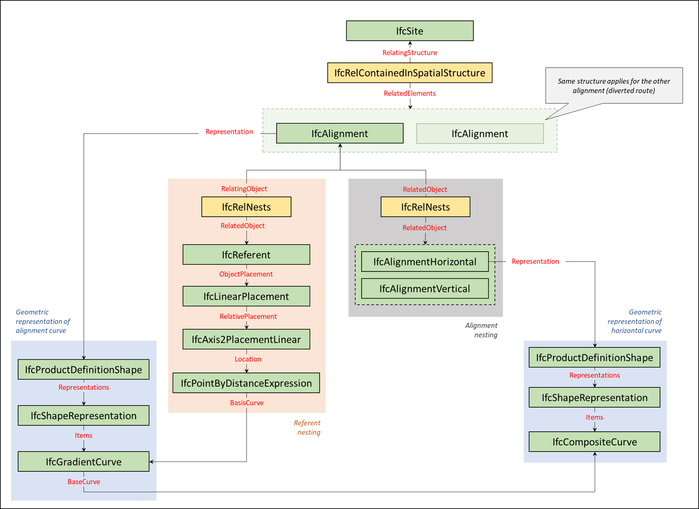

# Test instructions

| Documentation Code   | Test Title                        | Exchange Code | Test Code | Author          | Data Owner | Version | Date       |
|----------------------|-----------------------------------|---------------|-----------| ----------------|------------|---------|------------|
| IFC4.3AbRV_E1_AL24   | (RFI) Mileage for two alignments  | E1 (ALRF)     | AL24      | Evandro Alfieri | RFI        | 1.0     | DD.MM.YYYY |

## Summary (Intent)

This test case addresses the **export** and the **import** of the required IFC entities for the exchange of **stationing information for railway alignment without cant**. It builds on the test **AL22**, adding two `IfcReferent` entities, respectively to *Alignment 1_Primary route* and *Alignment 2_Diverted route*. These entities will be used:
- by the **export test** to verify the correct use of the nesting structure for `IfcReferent` into the `IfcAlignment`
- by the **import test**, along with some validation parameters, to verify the correct import of the provided alignemnt dataset.

Additional information:

- Refer to [Test Case Imports](#Test-Case-Imports) to know the prerequisites for the present test.

- The [Expected Results](#Expected-Results) section lists the material that will be used to assess the fulfilment of capabilities.

- :zap: This is a test-driven process: refer to the [Validation Criteria](#Validation-Criteria) to understand what is required by the test :zap:

## Itemised Roots

The Test instruction addresses the import and export of the following IFC Entities & Concept Templates:

IFC Entities

These entities represent a test-specific subset of the wider AbRV_E2a exchange and the overall AbRV MVD. **The scope of the test shall not be used as a definitive scope of the exchange, or of the MVD**

- Model setup:
   1. IfcSite
   1. IfcRailway
- Alignment:
   1. IfcAlignment
   1. IfcAlignmentHorizontal
   1. IfcAlignmentVertical
   1. IfcAlignmentSegment
   1. IfcReferent

Concept Templates
 

These concept templates represent a test-specific subset of the wider AbRV_Ex exchange and the overall AbRV MVD, that must be correctly exported to meet the validation criteria. **The scope of the test shall not be used as a definitive scope of the exchange, or of the MVD**

- Project Context
   - Project Global Positioning
- Object Composition
   - Spatial Decomposition
- Object Connectivity
   - Spatial Containment
- Product Shape
   - Product Geometric Representation
       - Alignment Geometry
          - Alignment Geometry Gradient
 - Nesting
   - Alignment Layout
   - Object Nesting (IfcReferent usage)

## Model Dataset

This test case utilises **no particular dataset**. All information required to fulfil the test are captured in these Test Instructions.

## Test Case Imports

All validation criteria (and usages) of predecessors' tests shall be **verified for this test too** (regression test principle). Prerequisites for the present test case are listed below.

| TI Code                        | Test Instruction Title               | Comments |
|--------------------------------|--------------------------------------|----------|
| [IFC4.3AbRV_E1_AL22](./AL22)   | (RFI) Two alignments without cant    | none     |

## Expected Results

For certification of capabilities the only source will be:

- n. 1 IFC file containing the information as requested. The file shall be named using the following syntax: `MVDCode`_`ExchangeCode`_`TestCode`_`SoftwareVendor`.`ifc` (Example: `IFC4.3AbRV_E2a_AL24_AmazingSoft.ifc`)

## Validation criteria
:zap: For this test case to be considered passed **all capabilities listed in this section**, and **the ones of pre-required tests** shall be verified, with no exception. :zap:

### General

| **RULE ID** | **CRITERIA**                                                      | **VALUE [examples]**  | **ENTITY (if applicable)** | **CT (if applicable)**     |
|-------------|-------------------------------------------------------------------|-----------------------|----------------------------|----------------------------|
| GENE_00     | All validation criteria of precondition's tests shall be verified |                       | na                         | na                         |
| GENE_01     | All requested entities (and attributes) exist in file             | As per Entities Table | na                         | na                         |

#### Entities Table

| **Element** | **Attribute**  | **Value**                        | **Notes**                            |
|-------------|----------------|----------------------------------|--------------------------------------|
| IfcReferent | Name           | 0+000                            | Nested by Alignment 1_Primary route  |
|             | Description    | Starting mileage for Alignemnt 1 |                                      |
|             | PredefinedType | REFERENCEMARKER                  |                                      |
| IfcReferent | Name           | 0+000                            | Nested by Alignment 2_Diverted route |
|             | Description    | Starting mileage for Alignemnt 2 |                                      |
|             | PredefinedType | REFERENCEMARKER                  |                                      |

### Railway alignment (without cant)

> **Acceptance criteria**: For the **Railway alignment (without cant)** capability, the validation procedure must verify that **all** the following validation criteria are satisfied.

| **RULE ID** | **CRITERIA**                                             | **VALUE [examples]**                           | **ENTITY (if applicable)** | **CT (if applicable)** |
|-------------|----------------------------------------------------------|------------------------------------------------|----------------------------|------------------------|
| SITE_00     | All IfcAlignment shall always be contained in an IfcSite |                                                |                            | Spatial Containment    |
| ALIG_00     | Alignment layout structure is verified                   | See steps                                      |                            | Alignment Layout       |
| ALIG_01     | Number of alignments contained in file                   | [2]                                            |                            |                        |
| ALIG_02     | Parameters of alignment segments are verified            | As per Alignment Table                         |                            |                        |
| ALIG_03     | Alignment geometric compliance is verified               | As per Alignment geometric compliance document |                            |                        |
| ALIG_04     | Value of the RailHeadDistance along the entire alignment | [1500 mm]                                      | IfcAlignmentCant           |                        |

ALIG_00 steps

| **STEP ID** | **STEP**                                                                                                                                           |
|-------------|----------------------------------------------------------------------------------------------------------------------------------------------------|
| ALIG_00.1   | Each IfcAlignment must nest exactly 1 IfcAlignmentHorizontal                                                                                       |
| ALIG_00.2   | Each IfcAlignment must nest at most 1 IfcAlignmentVertical                                                                                         |
| ALIG_00.3   | Each IfcAlignment must nest exactly 1 IfcAlignmentVertical                                                                                         |
| ALIG_00.6   | Each IfcAlignmentHorizontal must be nested only by 1 IfcAlignment                                                                                  |
| ALIG_00.7   | Each IfcAlignmentVertical must be nested only by 1 IfcAlignment                                                                                    |
| ALIG_00.9   | Each IfcAlignment must nest only the following entities: IfcAlignmentHorizontal, IfcAlignmentVertical, IfcAlignmentCant, IfcReferent, IfcAlignment |
| ALIG_00.10  | Each IfcAlignmentHorizontal nests a list of IfcAlignmentSegment, each of which has DesignParameters typed as IfcAlignmentHorizontalSegment         |
| ALIG_00.11  | Each IfcAlignmentVertical nests a list of IfcAlignmentSegment, each of which has DesignParameters typed as IfcAlignmentVerticalSegment             |

ALIG_04 details

> The *RailHeadDistance* (blue line in the figure below) is a normalized value used to compute the angle of cant. RFI uses 1500 mm for a track gauge of 1435 mm
>
>   

### Referent nesting

| **ID**  | **CRITERIA**                                                                        | **VALUE [examples]**   | **ENTITY (if applicable)** | **CT (if applicable)**             |
|---------|-------------------------------------------------------------------------------------|------------------------|----------------------------|------------------------------------|
| REFE_00 | There are two nesting relationships for referents and for alignment components      |                        |                            |                                    |
| REFE_01 | Relating Object and Distance Along for referent nesting are verified                | As per Referents Table | IfcReferent                | Object Nesting (IfcReferent usage) |

> **Acceptance criteria**: For the **Referent nesting** capability, the validation procedure must verify that **all** the above validation criteria are satisfied.

REFE_00 details: There are two nesting relationships for referents and for alignment components

> - Given an `IfcAlignment`
> - When `IfcAlignment` has an `IfcRelNests` relationship
> - Then the `IfcRelNests` relationship is related either to an `IfcReferent` OR to an `IfcLinearElement`

REFE_01 details: Relating Object and Distance Along for referent nesting are verified

> - Given a set of referents taken from the [Referents Table](#Referents-Table)
> - Then the Referent, with the Referent Type and Name, exists
> - And the Referent is placed relative to the Placement Product, using the requested Object Placement
> - And the Referent is placed at the requested DistanceAlong

Snippet:

*Figure 1: Example of the pattern of entities to be instantiated for referent nesting, along with other structures such as alignment nesting, spatial containment, geometric representation.*

#### Referents Table

| **Referent** | **Referent Type** | **Referent Name** | **Object Placement** | **Relative Placement Product** | **Relative Placement Product Type** | **Relative Placement Product Name** | **DistanceAlong** |
|--------------|-------------------|-------------------|----------------------|--------------------------------|-------------------------------------|-------------------------------------|-------------------|
| IfcReferent  | REFERENCEMARKER   | 0+000             | IfcLinearPlacement   | IfcAlignment                   | na                                  | Alignment 1_Primary route           | 0.000 m           |
| IfcReferent  | REFERENCEMARKER   | 0+000             | IfcLinearPlacement   | IfcAlignment                   | na                                  | Alignment 2_Diverted route          | 0.000 m           |

#### Validation parameters for import test
The parameters contained in the following sections are meant to verify the **correct import** of the alignment dataset provided in this test, into a receiving application.

**IMPORTANT**: to check most of the parameters below, the two `IfcReferent` entities above have to be defined.

 Alignment 1_Primary route 

| ID      | CRITERIA                                                            | VALUE        |
|---------|---------------------------------------------------------------------|--------------|
| ALIG_10 | Horizontal Starting point Mileage (pk)                              | 0+000        |
| ALIG_11 | Horizontal Starting point DistAlong                                 | 0.0000       |
| ALIG_12 | Horizontal Starting point X                                         | 452413.9199  |
| ALIG_13 | Horizontal Starting point Y                                         | 4539456.4011 |
| ALIG_14 | Vertical Starting point Mileage                                     | 0+000        |
| ALIG_15 | Vertical Starting point Z                                           | 5.0000       |
| ALIG_16 | Horizontal Ending point Mileage (pk)                                | 0+876.3682   |
| ALIG_17 | Horizontal Ending point DistAlong                                   | 876.3682     |
| ALIG_18 | Horizontal Ending point X                                           | 453202.5241  |
| ALIG_19 | Horizontal Ending point Y                                           | 4539831.9287 |
| ALIG_20 | Vertical Ending point Mileage                                       | 0+876.3682   |
| ALIG_21 | Vertical Ending point Z                                             | 2.0000       |
| ALIG_22 | Total 2D length of alignment (horizontal projection)                | 876.3682     |
| ALIG_23 | Total 3D length of alignment                                        | 876.3819     |
| ALIG_24 | Height difference between start and end point of alignment 3D curve | -3.0000      |

 Alignment 2_Diverted route 

| ID      | CRITERIA                                                            | VALUE        |
|---------|---------------------------------------------------------------------|--------------|
| ALIG_10 | Horizontal Starting point Mileage (pk)                              | 0+000        |
| ALIG_11 | Horizontal Starting point DistAlong                                 | 0.0000       |
| ALIG_12 | Horizontal Starting point X                                         | 452460.8898  |
| ALIG_13 | Horizontal Starting point Y                                         | 4539473.5425 |
| ALIG_14 | Vertical Starting point Mileage                                     | 0+000        |
| ALIG_15 | Vertical Starting point Z                                           | 5.0000       |
| ALIG_16 | Horizontal Ending point Mileage (pk)                                | 0+828.0965   |
| ALIG_17 | Horizontal Ending point DistAlong                                   | 828.0965     |
| ALIG_18 | Horizontal Ending point X                                           | 453208.8311  |
| ALIG_19 | Horizontal Ending point Y                                           | 4539818.3191 |
| ALIG_20 | Vertical Ending point Mileage                                       | 0+828.0965   |
| ALIG_21 | Vertical Ending point Z                                             | 2.0000       |
| ALIG_22 | Total 2D length of alignment (horizontal projection)                | 828.0965     |
| ALIG_23 | Total 3D length of alignment                                        | 828.1099     |
| ALIG_24 | Height difference between start and end point of alignment 3D curve | -3.0000      |

#### Notes on Pset usage for Linear Referencing Method and Stationing

There are two Pset applicable to IfcReferent that can be used for this test.
- `Pset_Stationing`: Specifies stationing parameters for IfcReferent;
- `Pset_LinearReferencingMethod`: Describes the manner in which measurements are made along (and optionally offset from) a linear element;
  - For `Pset_LinearReferencingMethod`, you might want to check that the property **LRMType** is set correctly. Example: in this test, being the referents placed at the origin point of each alignment to mark its initial stationing (i.e., 0+000), the the property value shall be set to **LRM_ABSOLUTE**