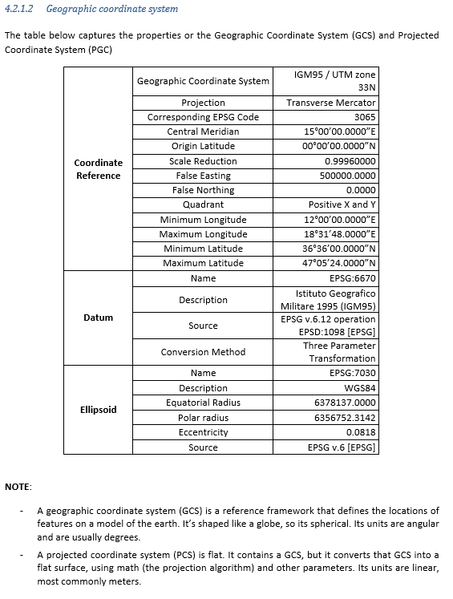

# Dataset description

| Documentation Code  | Test Title                           | Exchange Code | Test Code | Author          | Data Owner | Version | Date       |
|---------------------|--------------------------------------|---------------|-----------|-----------------|------------|---------|------------|
| IFC4.3AbRV_E2a_GL01 | (RFI) Global Positioning RFI dataset | E2a (TRAS)    | GL01      | Evandro Alfieri | RFI        | 1.0     | DD.MM.YYYY |

## Model Dataset

This test case utilises the following dataset.

| Filename                               | Type (format) | Description                                               |
|----------------------------------------|---------------|-----------------------------------------------------------|
| [GeographicData](./GeographicData.png) | table (png)   | [Geographic data relevant for the test](#Geographic-Data) |

### Geographic Data

The table below captures the properties of the Geographic Coordinate Reference System and Projected Coordinate Reference System, used in the test case mentioned in the header.

NOTE: for terminology and definition (e.g., Geographic Coordinate Reference System, Projected Coordinate Reference System) see **ISO:19111**

#### Table text for copy-paste

**Coordinate Reference System**
| Property                             | Value                |
|--------------------------------------|----------------------|
| Projected Coordinate Refernce System | IGM95 / UTM zone 33N |
| Projection                           | Transverse Mercator  |
| Corresponding EPSG Code              | 3065                 |
| Central Meridian                     | 15°00’00.0000”E      |
| Origin Latitude                      | 00°00’00.0000”N      |
| Scale Reduction                      | 0.99960000           |
| False Easting                        | 500000.0000          |
| False Northing                       | 0.0000               |
| Quadrant                             | Positive X and Y     |
| Minimum Longitude                    | 12°00’00.0000”E      |
| Maximum Longitude                    | 18°31’48.0000”E      |
| Minimum Latitude                     | 36°36’00.0000”N      |
| Maximum Latitude                     | 47°05’24.0000”N      |

**Datum**
| Property                     | Value                                     |
|------------------------------|-------------------------------------------|
| Name                         | EPSG:6670                                 |
| Description                  | Istituto Geografico Militare 1995 (IGM95) |
| Source                       | EPSG v.6.12 operation EPSD:1098 [EPSG]    |
| Conversion Method            | Three Parameter Transformation            |

**Vertical Datum**
| Property                     | Value                                     |
|------------------------------|-------------------------------------------|
| Name                         | EPSG:5214                                 |
| Description                  | Genoa height                              |

**Ellipsoid**
| Property                     | Value                                     |
|------------------------------|-------------------------------------------|
| Name                         | EPSG:7030                                 |
| Description                  | WGS84                                     |
| Equatorial Radius            | 6378137                                   |
| Polar radius                 | 6356752.314                               |
| Eccentricity                 | 0.0818                                    |
| Source                       | EPSG v.6 [EPSG]                           |