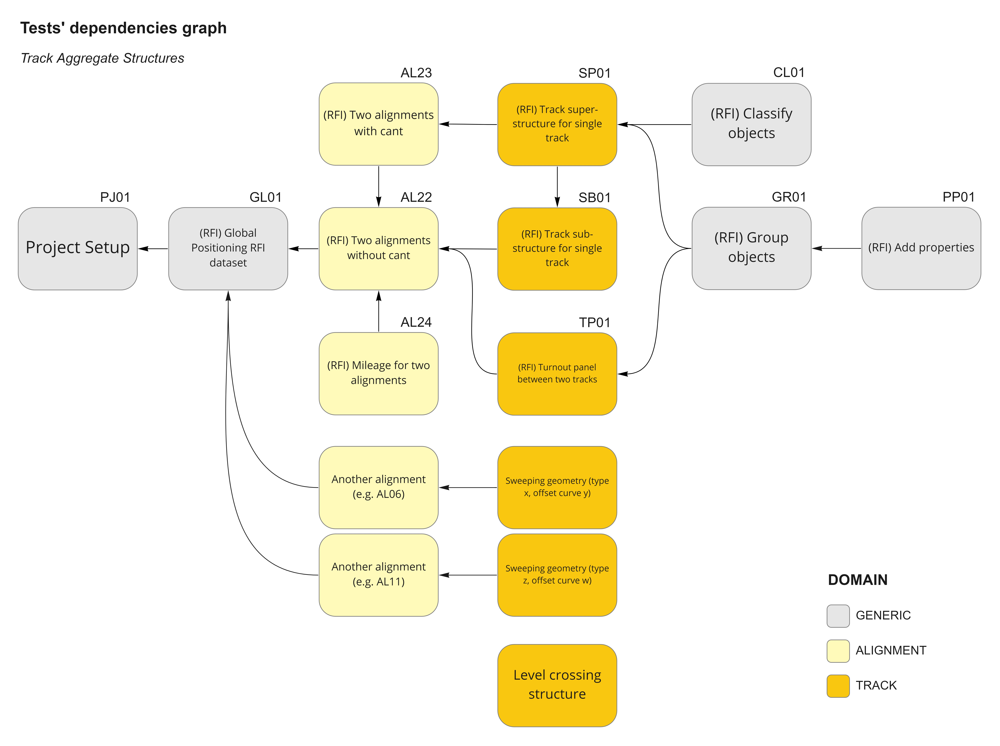

# Track Aggregate Structures Exchange

| Exchange Code       | Abbreviation | Exchange Name                       | Test Cases |
|---------------------|--------------|-------------------------------------|------------|
| **IFC4x3_AbRV-E2a** | TRAS         | Track Aggregate Structures Exchange | 12         |

Exchange Lead: IFCRail

## Summary

TBC

...The Track Structures Exchange is an extension *superset* of the Aggregate Structures Exchange ([IFC4x3_AbRV-E2](../E2-AGST))...

### Scope

The Track Structures Exchange is an extension *superset* of the Aggregate Structures Exchange ([IFC4x3_AbRV-E2](../E2-AGST)). Therefore the scope of this exchange includes the scope and tests outlined by the Aggregate Structures Exchange.

TBC

## Test Instructions
The list below represent the scope of the Integration Test that shall be passed to fulfil the Track Aggregate Structures Exchange.

Some tests are just referenced (hence reused entirely) from other Exchanges.

| TI Code                            | Test Instruction Title                       | Reused | Dependencies            |
|------------------------------------|----------------------------------------------|:------:|-------------------------|
| [**IFC4x3_AbRV-E2a-PJ01**](./PJ01) | Project Setup                                | X      | none                    |
| [**IFC4x3_AbRV-E2a-GL01**](./GL01) | (RFI) Global Positioning RFI dataset         | ?      | PJ01                    |
| [**IFC4x3_AbRV-E1-AL22**](./AL22)  | (RFI) Two alignments without cant            | X      | GL01                    |
| [**IFC4x3_AbRV-E1b-AL23**](./AL23) | (RFI) Two alignments with cant               | X      | AL22                    |
| [**IFC4x3_AbRV-E1-AL24**](./AL24)  | (RFI) Mileage for two alignments             |        | AL23                    |
| [**IFC4x3_AbRV-E2a-SB01**](./SB01) | (RFI) Track sub-structure for single track   |        | AL23                    |
| [**IFC4x3_AbRV-E2a-SP01**](./SP01) | (RFI) Track super-structure for single track |        | AL23                    |
| [**IFC4x3_AbRV-E2a-TSTP**](./TSTP) | Track Structures Turnout Panel               |        | AL23                    |
| [**IFC4x3_AbRV-E2a-GR01**](./GR01) | (RFI) Group objects                          |        | SB01, SP01              |
| [**IFC4x3_AbRV-E2a-CL01**](./CL01) | (RFI) Classify objects                       |        | SB01, SP01              |
| [**IFC4x3_AbRV-E2a-PP01**](./PP01) | (RFI) Add properties                         |        | GR01                    |
| [**IFC4x3_AbRV-E2a-LC01**](./LC01) | Level crossing structure                     |        | another alignment test  |
| [**IFC4x3_AbRV-E2a-SW01**](./SW01) | Sweeping geometry (type x, offset curve y)   |        | another alignment test  |
| [**IFC4x3_AbRV-E2a-SW02**](./SW02) | Sweeping geometry (type z, offset curve w)   |        | another alignment test  |
| [**IFC4x3_AbRV-E2a-SW0n**](./SW0n) | Sweeping geometry (type j, offset curve k)   |        | another alignment test  |

> Note for MVD project: all tests except SB01, SP01, and TP01 can be moved to another Exchange **as long as** such "generic" Exchange will be made mandatory for certification. Otherwise, all tests listed above shall be consider part of E2a Exchange.

### Test dependencies graph

