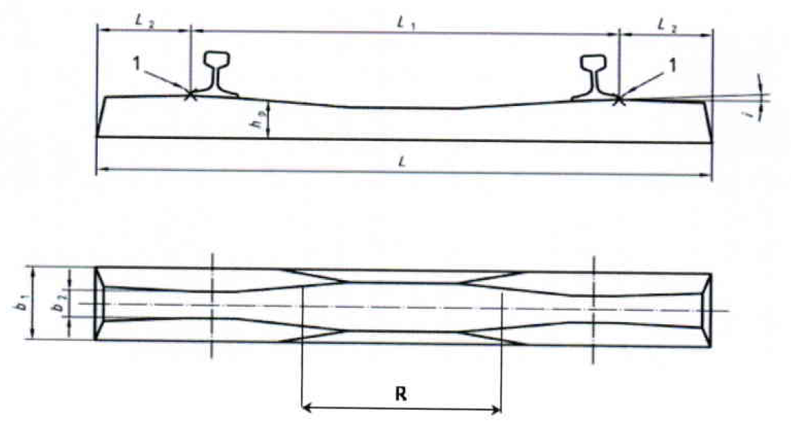

# Dataset description

| Documentation Code   | Test Title                             | Exchange Code | Test Code | Author          | Data Owner | Version | Date       |
|----------------------|----------------------------------------|---------------|-----------| ----------------|------------|---------|------------|
| IFC4.3AbRV_E2a_SP01  | (RFI) Track structure for single track | E2a (TRAS)    | SP01      | Evandro Alfieri | RFI        | 1.0     | DD.MM.YYYY |

## Model Dataset

This test case utilises the following dataset.

| Filename               | Type (format) | Description                                                                       |
|------------------------|---------------|-----------------------------------------------------------------------------------|
| TrackCrossSection      | drawing (png) | [Track cross section](#Track-Cross-Section) to be used as example                 |
| Cant-CantAngle         | figure (png)  | Information on how [cant](#Applied-cant) is applied to rail                       |
| CantFromLowerRail      | figure (png)  | Information on how [cant](#Applied-cant) is applied to rail                       |
| SleeperPlacement       | figure (png)  | Information on how to [position sleepers](#Sleeper-placement) along the alignment |
| RailProfile60UIC       | drawing (jpg) | Drawing of the [rail profile](#rail-profile) E601 (aka, UIC 60) to be used        |
| SleeperExampleRFI230   | drawing (png) | Example of [shape and tolerances](#sleeper-example) of a concrete sleeper         |

## Track Cross Section

The image below shows the different elements of the track super-structure (green in picture) to be represented. (For the track sub-structure part, red in picture below, refer to test case **IFC4.3AbRV_E2a_SB01**.)

From bottom-up:
- the ballast bed
- the sleeper
- the two rails

### Applied cant
In a cross-section plane, orthogonal to the track axis, it is the difference in height (ht in the picture below) between two points, of the track plane, that have a conventional distance between them of 1500 mm (known as Rail Heads distance). For this test, the cant is always applied to the external rail (the furthest rail from the center or the curve). Thus, cant is measured from the lower rail (inner rail)

NOTE:
- The dataset for this test comes from an Italian stakeholder (RFI). In Italy, only straight line is used for cant segment
- The `RailHeadDistance` (light blue in figure below; or 2b0 in figure above) is a normalized value used to compute the angle of cant. RFI uses 1500mm for a track gauge of 1435mm.

### Straight and curved parts
The sub-structure part (red) is not influenced by cant. So, it is expected to have the same representation both in straight parts and in curves. The super-structure (green), has a different behaviour for ballast and sleeper in curve, compared to straight parts.

As depicted in the image below, and as stated in the [Applied cant](#Applied-cant) section, the inner rail is the lower rail. This stays fix, while the outer rail rotates (goes up). In all this, the ballast **shall always maintain the 4/3 ratio for its slope**, as shown below.  

## Sleeper placement
The image below capture some details about the placement of sleepers.

- Sleepers are linearly positioned along the alignment
- The reference for their positioning is the alignment curve (horizontal + vertical)
- The span between the sleepers is 660 mm, measured on the horizontal plane
- Their orientation is affected by cant
- Considering the insertion point (O) being the one showed in picture below, the sleeper is positioned with an offset from the alignemnt curve
- This offset is influenced by cant (as this offset is always perpendicular to the track plane) 
- The success of the test is independent from the choice to use a detailed sleeper (up-right) or a simplified sleeper (bottom-right), as **the relationship between the origin of the sleeper (O) and the alignment curve (A), as showed in picture, is not affected by the geometric detail of the sleeper's shape**.

## Rail profile
The image below shows the profile section of the international UIC 60 rail profile. This has to be considered just a reference, as **the success of the test is independent from the rail profile used**. For the sake fo test, any simplified profile is equally accepted. 

## Sleeper example
The image below shows the shape and tolerances for a type of concrete sleeper (RFI 230). This has to be considered just a reference, as **the success of the test is independent from the sleeper type used**. For the sake fo test, any simplified profile is equally accepted.

Where:
- L = 2300 mm
- b1 = 300 mm
- Height of sleeper in proximity of the rail = 170-190 mm

