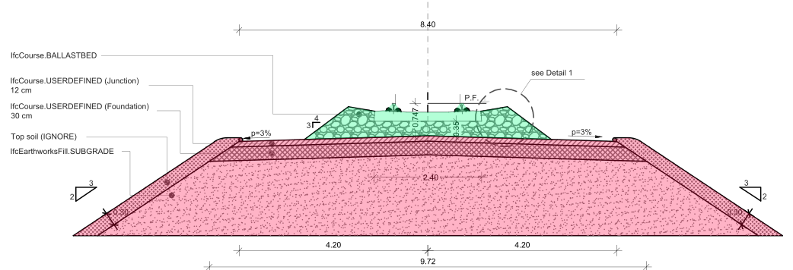

# Test instructions

| Documentation Code   | Test Title                             | Exchange Code | Test Code | Author          | Data Owner | Version | Date       |
|----------------------|----------------------------------------|---------------|-----------| ----------------|------------|---------|------------|
| IFC4.3AbRV_E2a_SP01  | 	(RFI) Track super-structure for single track | E2a (TRAS)    | SP01      | Evandro Alfieri | RFI        | 1.0     | DD.MM.YYYY |

## Summary (Intent)

This test case addresses the **export** of the required IFC entities for the exchange of **track super-structure** information.

This test case focuses only on track super-structure (green in picture below). For the track sub-structure part (red in picture below), refer to test case **IFC4.3AbRV_E2a_SB01**, of which SP01 is an extension.

Snippet:

The test also includes the association of some track products (rails, sleepers, ballast, etc.) to: i) the required model breakdown elements (aka, **spatial structure containment**); ii) the required materials (aka, **material association**).

- Refer to [Test Case Imports](#Test-Case-Imports) to know the prerequisites for the present test.

- The [Expected Results](#Expected-Results) section lists the material that will be used to assess the fulfilment of capabilities.

- :zap: This is a test-driven process: refer to the [Validation Criteria](#Validation-Criteria) to understand what is required by the test :zap:

## Itemised Roots
:construction: **under construction, check CT for product shape** :construction:

The Test instruction addresses the import and export of the following IFC Entities & Concept Templates:

IFC Entities

These entities represent a test-specific subset of the wider AbRV_E2a exchange and the overall AbRV MVD. **The scope of the test shall not be used as a definitive scope of the exchange, or of the MVD**

- Model setup:
   1. IfcFacilityPart
- Track domain physical products:
   1. IfcRail / IfcRailType
   1. IfcTrackElement
   1. IfcCourse / IfcCourseType

Concept Templates
 

These concept templates represent a test-specific subset of the wider AbRV_Ex exchange and the overall AbRV MVD, that must be correctly exported to meet the validation criteria. **The scope of the test shall not be used as a definitive scope of the exchange, or of the MVD**

- Object Attributes
   - Object Predefined Type
- Object definition
   - Object Typing
- Product Shape
   - Product Geometric Representation
   - Body SectionedSolidHorizontal
- Object Composition
   - Spatial Decomposition
- Object Connectivity
   - Spatial Containment
- Object Association
   - Material Association

## Model Dataset

This test case utilises the dataset collected in the Dataset folder and summarised in the table below. **For more details on each item see [Dataset description](Dataset/README.md).**

| Filename             | Type (format) | Description                                                 |
|----------------------|---------------|-------------------------------------------------------------|
| TrackCrossSection    | drawing (png) | Track cross section to be used as example                   |
| Cant-CantAngle       | figure (png)  | Information on how cant is applied to rail                  |
| CantFromLowerRail    | figure (png)  | Information on how cant is applied to rail                  |
| SleeperPlacement     | figure (png)  | Information on how to position sleepers along the alignment |
| RailProfile60UIC     | drawing (jpg) | Drawing of the rail profile E601 (aka, UIC 60) to be used   |
| SleeperExampleRFI230 | drawing (png) | Example of shape and tolerances of a concrete sleeper       |

## Test Case Imports

All validation criteria (and usages) of predecessors' tests shall be **verified for this test too** (regression test principle). Prerequisites for the present test case are listed below.

| TI Code                        | Test Instruction Title               | Comments |
|--------------------------------|--------------------------------------|----------|
| [IFC4.3AbRV_E1b_AL23](./AL23)  | (RFI) Two alignments with cant       | **For the test to be passed, the track sub-structure shall be modelled ONLY for the Primary Route (i.e., Alignment 1_Primary route)** |
| [IFC4.3AbRV_E2a_SB01](./SB01)  | (RFI) Track sub-structure for single track |  |

## Usages, Constraints & Logic 
:construction: **under construction, miss Model Geometry usages for sweep** :construction:

The following itemised restrictions and constraints shall be placed on IFC Entities & Concept Templates:

Semantic Usages, Constraints & Logic

- On Body SectionedSolidHorizontal ...

Model Geometry

The Test case requires the following additional checks related to Model Geometry:

- On sweep of IfcCourse: ...

## Expected Results

For certification of capabilities the only source will be:

- n. 1 IFC file containing the information as requested. The file shall be named using the following syntax: `MVDCode`_`ExchangeCode`_`TestCode`_`SoftwareVendor`.`ifc` (Example: `IFC4.3AbRV_E2a_SP01_AmazingSoft.ifc`)

# Validation criteria
:zap: For this test case to be considered passed **all capabilities listed in this section**, and **the ones of pre-required tests** shall be verified, with no exception. :zap:

### General

- All the concept templates must be correctly implemented as presented in the validation criteria
- At least 1 instance of each entity listed in [Itemised Roots](#Itemised-Roots) is present in the file
- All validation criteria of the pre-required tests shall apply here too

| **ID**  | **CRITERIA**                                      | **VALUE** | **COMMENT** |
|---------|---------------------------------------------------|-----------|-------------|
| ENAT_01 | Requested entities (and attributes) exist in file | See below |             |

Entities and attributes

`IfcFacilityPart` (BC01)

| Attribute      | Value                               |
|----------------|-------------------------------------|
| Name           | LO1336-BC-BC01                      |
| Description    | Binario IV dispari - Orte Falconara |
| ObjectType     | $                                   |
| PredefinedType | TRACKSTRUCTURE                      |

`IfcFacilityPart` (BC02)

| Attribute      | Value                               |
|----------------|-------------------------------------|
| Name           | LO1336-BC-BC02                      |
| Description    | Binario V dispari - Orte Falconara  |
| ObjectType     | $                                   |
| PredefinedType | TRACKSTRUCTURE                      |

`IfcCourse` (BC01)

| Attribute      | Value                        |
|----------------|------------------------------|
| Name           | LO1336-BC-BC01-MAS-M01       |
| Description    | Segmento di massicciata M01  |
| ObjectType     | $                            |
| PredefinedType | BALLASTBED                   |

NOTE: all IfcCourse entities are to be typed by the IfcCourseType entity below (via `IfcRelDefinesByType`). This is important because in a following test properties will be associated to the type, and are expected to be inherited by the IfcCourse occurrences.

`IfcCourseType`

| Attribute      | Value                        |
|----------------|------------------------------|
| Name           | Segmento di massicciata      |
| Description    | $                            |
| PredefinedType | BALLASTBED                   |

`IfcRail` (BC01, DX)

| Attribute      | Value          |
|----------------|----------------|
| Name           | Rotaia BC01 DX |
| Description    | $              |
| ObjectType     | $              |
| PredefinedType | RAIL           |

`IfcRail` (BC01, SX)

| Attribute      | Value          |
|----------------|----------------|
| Name           | Rotaia BC01 SX |
| Description    | $              |
| ObjectType     | $              |
| PredefinedType | RAIL           |

NOTE: all IfcRail entities are to be typed by the IfcRailType entity below (via `IfcRelDefinesByType`). This is important because in this test materials will be associated to the type, and are expected to be inherited by the IfcRail occurrences.

`IfcRailType`

| Attribute      | Value       |
|----------------|-------------|
| Name           | Rotaia 60E1 |
| Description    | Rail UIC 60 |
| PredefinedType | RAIL        |

`IfcTrackElement`

| Attribute      | Value          |
|----------------|----------------|
| Name           | Traversa 0000  |
| Description    | $              |
| ObjectType     | $              |
| PredefinedType | SLEEPER        |

NOTE: 0000 indicates the progressive number of each sleeper (i.e., Traversa 0001, Traversa 0002, Traversa 0003, etc.)

### Object typing

> **Acceptance criteria**: For the **Object typing** capability, the validation procedure must verify that an IFC entity type with the given Name is typing (via `IfcRelDefinesByType`) exactly a given number of objects of the requested Name, no more and no less.
>
> If present, all criteria listed in [Usages, Constraints & Logic](#Usages,-Constraints-&-Logic), and in the same section of precondition tests, shall be verified too.

| Entity Type   | Entity Type Name        | Minimum | Maximum | IfcObject | IfcObject Name              |
|---------------|-------------------------|---------|---------|-----------|-----------------------------|
| IfcCourseType | Segmento di massicciata | 1       |         | IfcCourse | Segmento di massicciata M01 |
| IfcRailType   | Rotaia 60E1             | 1       |         | IfcRail   | Rotaia BC01 DX              |
| IfcRailType   | Rotaia 60E1             | 1       |         | IfcRail   | Rotaia BC01 SX              |

NOTE:
- when **Minimum** and **Maximum** have the same value, it means exactly. Example: Minimum=Maximum=1, means that the entity type must type exactly 1 object with that Name.
- when **Maximum is empty**, it means **unlimited**. Example: Minimum=1; Maximum=empty, means that the Entity Type must type 1 or more Object of the requested name.

### Spatial decomposition

> **Acceptance criteria**: For the **Spatial decomposition** capability, the validation procedure must verify that a Parent Element of the requested type aggregates (via `IfcRelAggregates`) exactly a given number of Child Elements of the requested type, no more and no less.

| Parent Element | Parent Element Type | Minimum | Maximum | Child Element   | Child Element Type |
|----------------|---------------------|---------|---------|-----------------|--------------------|
| IfcRailway     | Località            | 2       | 2       | IfcFacilityPart | TRACKSTRUCTURE     |

### Spatial containment

> **Acceptance criteria**: For the **Spatial containment** capability, the validation procedure must verify that a Spatial Element of the requested type contains (via `IfcRelContainedInSpatialStructure`) exactly a given number of Elements of the requested type, no more and no less.

| Spatial Element | Spatial Element Type | Minimum | Maximum | Element            | Element Type      |
|-----------------|----------------------|---------|---------|--------------------|-------------------|
| IfcFacilityPart | TRACKSTRUCTURE       | 1       |         | IfcCourse          | BALLASTBED        |
| IfcFacilityPart | TRACKSTRUCTURE       | 2       |         | IfcRail            | RAIL              |
| IfcFacilityPart | TRACKSTRUCTURE       | 1       |         | IfcTrackElement    | SLEEPER           |

NOTE:
- when **Maximum is empty**, it means **unlimited**. Example: Minimum=1; Maximum=empty, means that the Spatial Element must contain 1 or more elements of the requested type.

### Material association

> **Acceptance criteria**: For the **Material association** capability, the validation procedure must verify that an Object of the requested type is associated (via `IfcRelAssociatesMaterial`) to a material definition with the requested name.

| Object         | Object Type | Material definition | Material name |
|----------------|-------------|---------------------|---------------|
| IfcCourseType  | BALLASTBED  | IfcMaterial         | Gravel        |
| IfcRail        | RAIL        | IfcMaterialProfile  | 60E1          | 
| IfcTrackElement| SLEEPER     | IfcMaterial         | Concrete      | 

