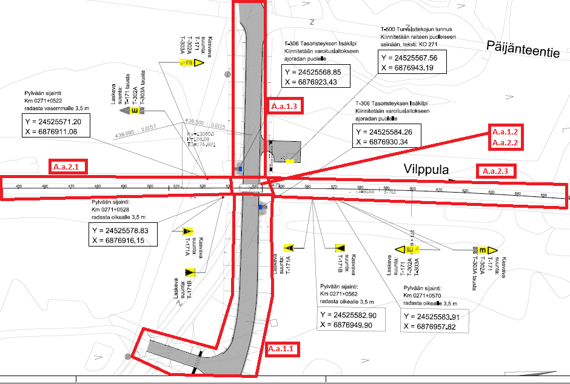

## Variations
The following occurrence variations need to be checked and certified in relation to the targeted entities and concept templates:

- Entity_01 - *decription of variation*
- Entity_02 - *decription of variation*

## Model Dataset
This test case utilises the attached dataset documented by the following drawings and data schedule. 

*This is a later step that involved the detailed documentation of the certification dataset (model)*

### Track alignment:

| Name    | Type                   | ObjectPlacement   | Representation                                               |
| ------- | ---------------------- | ----------------- | ------------------------------------------------------------ |
| A.a.A1  | IfcAlignment           | IfcLocalPlacement | IfcGradientCurve RepresentationIdentifier="Axis" RepresentationType="Curve3D" |
| A.a.AH1 | IfcAlignmentHorizontal | IfcLocalPlacement | IfcCompositeCurve RepresentationIdentifier="Axis" RepresentationType="Curve2D" |
| A.a.AV1 | IfcAlignmentVertical   | IfcLocalPlacement | IfcGradientCurve RepresentationIdentifier="Axis" RepresentationType="Curve3D" |

#### Horizontal segments nested into AH1 in the following order:

| Name | Type                          | StartPointX | StartPointY | StartDirection | StartRadius | EndRadius | Length      | Type_1      |
| ---- | ----------------------------- | ----------- | ----------- | -------------- | ----------- | --------- | ----------- | ----------- |
| H1   | IfcAlignmentHorizontalSegment | 1304,078529 | 2487,611348 | 4,207620618    | 0           | 0         | 1091,152467 | LINE        |
| H2   | IfcAlignmentHorizontalSegment | 776,392063  | 1532,540304 | 4,207620618    | 0           | 1518      | 80          | CLOTHOID    |
| H3   | IfcAlignmentHorizontalSegment | 738,321388  | 1462,182442 | 4,233696595    | 1518        | 1518      | 513,309402  | CIRCULARARC |
| H4   | IfcAlignmentHorizontalSegment | 582,796258  | 975,564171  | 4,572119564    | 1518        | 0         | 80          | CLOTHOID    |
| H5   | IfcAlignmentHorizontalSegment | 573,004982  | 896,168101  | 4,598470026    | 0           | 0         | 154,948149  | LINE        |
| H6   | IfcAlignmentHorizontalSegment | 555,391605  | 742,224288  | 4,598470026    | 0           | -1486     | 90          | CLOTHOID    |
| H7   | IfcAlignmentHorizontalSegment | 544,259467  | 652,919107  | 4,568327586    | -1486       | -1486     | 235,958273  | CIRCULARARC |
| H8   | IfcAlignmentHorizontalSegment | 491,993759  | 423,076296  | 4,409399855    | -1486       | 0         | 90          | CLOTHOID    |
| H9   | IfcAlignmentHorizontalSegment | 463,412608  | 337,73898   | 4,379117218    | 0           | 0         | 316,307118  | LINE        |

#### Vertical segments nested into AV1 in the following order:

| Name | Type                        | StartDistAlong | HorizontalLength | StartHeight | StartGradient | EndGradient  | Radius | Type_1           |
| ---- | --------------------------- | -------------- | ---------------- | ----------- | ------------- | ------------ | ------ | ---------------- |
| V1   | IfcAlignmentVerticalSegment | 0,000407982    | 246,4273892      | 108,082846  | 0,012500014   | 0,012500014  | 0      | CONSTANTGRADIENT |
| V2   | IfcAlignmentVerticalSegment | 246,4277972    | 95,01277799      | 111,1631917 | 0,012500014   | 0,002997773  | -10000 | CIRCULARARC      |
| V3   | IfcAlignmentVerticalSegment | 341,4405752    | 85,15793083      | 111,899419  | 0,002997773   | 0,002997773  | 0      | CONSTANTGRADIENT |
| V4   | IfcAlignmentVerticalSegment | 426,598506     | 183,6600283      | 112,1547031 | 0,002997773   | 0,013202245  | 18000  | CIRCULARARC      |
| V5   | IfcAlignmentVerticalSegment | 610,2585343    | 701,6062339      | 113,6423122 | 0,013202245   | 0,013202245  | 0      | CONSTANTGRADIENT |
| V6   | IfcAlignmentVerticalSegment | 1311,864768    | 34,07192867      | 122,9050894 | 0,013202245   | 0,011498258  | -20000 | CIRCULARARC      |
| V7   | IfcAlignmentVerticalSegment | 1345,936697    | 236,655805       | 123,325886  | 0,011498258   | 0,011498258  | 0      | CONSTANTGRADIENT |
| V8   | IfcAlignmentVerticalSegment | 1582,592502    | 353,6059896      | 126,0470154 | 0,011498258   | -0,015704899 | -13000 | CIRCULARARC      |
| V9   | IfcAlignmentVerticalSegment | 1936,198491    | 119,9639637      | 125,3034062 | -0,015704899  | -0,015704899 | 0      | CONSTANTGRADIENT |
| V10  | IfcAlignmentVerticalSegment | 2056,162455    | 282,6533323      | 123,4193842 | -0,015704899  | -4,51E-15    | 18000  | CIRCULARARC      |
| V11  | IfcAlignmentVerticalSegment | 2338,815787    | 312,8596206      | 121,2       | 2,38704E-12   | 2,38704E-12  | 0      | CONSTANTGRADIENT |

### Main road alignment:

| Name    | Type                   | ObjectPlacement   | Representation                                               |
| ------- | ---------------------- | ----------------- | ------------------------------------------------------------ |
| A.a.A2  | IfcAlignment           | IfcLocalPlacement | IfcGradientCurve RepresentationIdentifier="Axis" RepresentationType="Curve3D" |
| A.a.AH2 | IfcAlignmentHorizontal | IfcLocalPlacement | IfcCompositeCurve RepresentationIdentifier="Axis" RepresentationType="Curve2D" |
| A.a.AV2 | IfcAlignmentVertical   | IfcLocalPlacement | IfcGradientCurve RepresentationIdentifier="Axis" RepresentationType="Curve3D" |

#### Horizontal segments nested into AH2 in the following order:

| Name | Type                          | StartPointX | StartPointY | StartDirection | StartRadius | EndRadius | Length     | Type_1      |
| ---- | ----------------------------- | ----------- | ----------- | -------------- | ----------- | --------- | ---------- | ----------- |
| H21  | IfcAlignmentHorizontalSegment | 276,867419  | 935,549267  | 0,001724622    | 0           | 0         | 229,405681 | LINE        |
| H22  | IfcAlignmentHorizontalSegment | 506,272759  | 935,944905  | 0,00172463     | -110        | -110      | 15,594208  | CIRCULARARC |
| H23  | IfcAlignmentHorizontalSegment | 521,816666  | 934,8682    | 6,143144395    | 0           | 0         | 91,725737  | LINE        |
| H24  | IfcAlignmentHorizontalSegment | 612,644434  | 922,064789  | 6,143144399    | -110        | -110      | 120,80482  | CIRCULARARC |
| H25  | IfcAlignmentHorizontalSegment | 701,264387  | 849,049537  | 5,044918731    | 0           | 0         | 25,538554  | LINE        |
| H26  | IfcAlignmentHorizontalSegment | 709,601071  | 824,909996  | 5,044918761    | 110         | 110       | 49,633636  | CIRCULARARC |
| H27  | IfcAlignmentHorizontalSegment | 735,66497   | 783,164849  | 5,49613363     | 0           | 0         | 83,739856  | LINE        |

#### Vertical segments nested into AV2 in the following order:

| Name | Type                        | StartDistAlong | HorizontalLength | StartHeight | StartGradient | EndGradient  | Radius | Type_1           |
| ---- | --------------------------- | -------------- | ---------------- | ----------- | ------------- | ------------ | ------ | ---------------- |
| V21  | IfcAlignmentVerticalSegment | 135,557        | 10,84246946      | 125,687614  | 0,03416131    | 0,03416131   | 0      | CONSTANTGRADIENT |
| V22  | IfcAlignmentVerticalSegment | 146,3994695    | 18,11228261      | 126,058007  | 0,03416131    | 0,020212997  | -1300  | CIRCULARARC      |
| V23  | IfcAlignmentVerticalSegment | 164,5117521    | 40,83305808      | 126,5504044 | 0,020212997   | 0,020212997  | 0      | CONSTANTGRADIENT |
| V24  | IfcAlignmentVerticalSegment | 205,3448102    | 39,03368133      | 127,3757629 | 0,020212997   | -0,009817512 | -1300  | CIRCULARARC      |
| V25  | IfcAlignmentVerticalSegment | 244,3784915    | 50,17607352      | 127,5786042 | -0,009817512  | -0,009817512 | 0      | CONSTANTGRADIENT |
| V26  | IfcAlignmentVerticalSegment | 294,554565     | 11,522986        | 127,086     | 0             | 0            | 0      | CONSTANTGRADIENT |
| V27  | IfcAlignmentVerticalSegment | 306,077551     | 192,5126892      | 127,086     | -0,003529811  | -0,003529811 | 0      | CONSTANTGRADIENT |
| V28  | IfcAlignmentVerticalSegment | 498,5902402    | 15,27528964      | 126,4064666 | -0,003529811  | -0,006584989 | -5000  | CIRCULARARC      |
| V29  | IfcAlignmentVerticalSegment | 513,8655298    | 78,35926585      | 126,3292136 | -0,006584989  | -0,006584989 | 0      | CONSTANTGRADIENT |
| V210 | IfcAlignmentVerticalSegment | 592,2247957    | 10,41034226      | 125,8132186 | -0,006584989  | 0,00142311   | 1300   | CIRCULARARC      |
| V211 | IfcAlignmentVerticalSegment | 602,6351379    | 13,80735508      | 125,7863506 | 0,00142311    | 0,00142311   | 0      | CONSTANTGRADIENT |

#### Dataset structure:

The following dataset structure shall be represented :

| Name            | Entity                   | Type                      | Container Assembly | Representation                             | Placement                                                    | Comment                                                      |
| --------------- | ------------------------ | ------------------------- | ----------------------- | ------------------------------------------ | ------------------------------------------------------------ | ------------------------------------------------------------ |
| A               | IfcProject               |                           |                         |                                            |                                                              |                                                              |
| A.a             | IfcSite                  |                           | A                       | Optional                                   | Local placement                                              |                                                              |
| A.a.A1          | IfcAlignment             |                           | A.a                     | IfcGradientCurve                           | Local placement                                              | SIIRTO_ORIVESI-HAAPAMAKI_270-273_GK24_KAANNETTY according to specification above |
| A.a.AH1         | IfcAlignmentHorizontal   |                           | A.a.A1                  | IfcCompositeCurve                          | Local placement                                              |                                                              |
| A.a.AV1         | IfcAlignmentVertical     |                           | A.a.A1                  | IfcGradientCurve                           | Local placement                                              |                                                              |
| A.a.A2          | IfcAlignment             |                           | A.a                     | IfcGradientCurve                           | Local placement                                              | TOI_M14334_0000A according to specification                  |
| A.a.AH2         | IfcAlignmentHorizontal   |                           | A.a.A2                  | IfcCompositeCurve                          | Local placement                                              |                                                              |
| A.a.AV2         | IfcAlignmentVertical     |                           | A.a.A2                  | IfcGradientCurve                           | Local placement                                              |                                                              |
| A.a.1           | IfcRoad                  |                           | A.a                     | Optional                                   | Local placement                                              |                                                              |
| A.a.1.SA1       | IfcElementAssembly       | SIGNALASSEMBLY            | A.a.1                   | See TOI_Boom_barrier_system_329100    | Linear placement (A.a.A2.IfcGradientCurve, DistanceAlong=293, No offsets) |                                                              |
| A.a.1.SA1.D1    | IfcDoor                  | BOOM_BARRIER              | A.a.1.SA1               | See TOI_Boom_barrier_system_329100    | Local placement                                              |                                                              |
| A.a.1.SA1.F1    | IfcFooting               | PAD_FOOTING               | A.a.1.SA1               | See TOI_Boom_barrier_system_329100    | Local placement                                              |                                                              |
| A.a.SA1.R1      | IfcRailing               | GUARDRAIL                 | A.a.1.SA1               | See TOI_Boom_barrier_system_329100    | Local placement                                              |                                                              |
| A.a.SA1.SA2     | IfcElementAssembly       | SIGNALASSEMBLY            | A.a.1.SA1               | See TOI_Boom_barrier_system_329100    | Local placement                                              |                                                              |
| A.a.SA1.SA2.P1  | IfcPost                  | MEMBER                    | A.a.SA1.SA2             | See TOI_Boom_barrier_system_329100    | Local placement                                              |                                                              |
| A.a.SA1.SA2.SV1 | IfcSignal                | VISUAL                    | A.a.SA1.SA2             | See TOI_Boom_barrier_system_329100    | Local placement                                              |                                                              |
| A.a.SA1.SA2.SA1 | IfcSignal                | AUDIO                     | A.a.SA1.SA2             | See TOI_Boom_barrier_system_329100    | Local placement                                              |                                                              |
| A.a.SA1.SA2.SP1 | IfcSign                  | PICTORAL                  | A.a.SA1.SA2             | See TOI_Boom_barrier_system_329100    | Local placement                                              |                                                              |
| A.a.1.1         | IfcFacilityPart          | ROADSEGMENT               | A.a.1                   | Optional                                   |                                                              | UsageType=LONGITUDINAL                                       |
| A.a.1.2         | IfcFacilityPart          | LEVELCROSSING             | A.a.1                   | Optional                                   |                                                              | UsageType=LONGITUDINAL                                       |
| A.a.1.3         | IfcFacilityPart          | ROADSEGMENT               | A.a.1                   | Optional                                   |                                                              | UsageType=LONGITUDINAL                                       |
| A.a.2           | IfcRailway               |                           | A.a                     | Optional                                   |                                                              |                                                              |
| A.a.2.1         | IfcFacilityPart          | TRACKSTRUCTUREPART        | A.a.2                   | Optional                                   |                                                              | UsageType=LONGITUDINAL                                       |
| A.a.2.2         | IfcFacilityPart          | LEVELCROSSING             | A.a.2                   | Optional                                   |                                                              | UsageType=LONGITUDINAL                                       |
| A.a.2.3         | IfcFacilityPart          | TRACKSTRUCTUREPART        | A.a.2                   | Optional                                   |                                                              | UsageType=LONGITUDINAL                                       |
| A.a.2.2.WS1     | IfcSensor                | WHEELSENSOR               | A.a.2.2                 | See TOI_Axle_counter_329161           | Linear placement (A.a.A1.IfcGradientCurve, DistanceAlong=1746, OffsetLateral=-0.35, OffsetVertical=-0.221) |                                                              |
| A.a.2.2.WS2     | IfcSensor                | WHEELSENSOR               | A.a.2.2                 | See TOI_Axle_counter_329161           | Linear placement (A.a.A1.IfcGradientCurve, DistanceAlong=1715, OffsetLateral=-0.35, OffsetVertical=-0.221) |                                                              |
| A.a.2.2.JB1     | IfcJunctionBox           | DATA                      | A.a.2.2                 | See TOI_Cable_junction_box_329161     | Linear placement (A.a.A1.IfcGradientCurve, DistanceAlong=1746, OffsetLateral=-0.95, OffsetVertical=-0.221) |                                                              |
| A.a.2.2.JB2     | IfcJunctionBox           | DATA                      | A.a.2.2                 | See TOI_Cable_junction_box_329161     | Linear placement (A.a.A1.IfcGradientCurve, DistanceAlong=1715, OffsetLateral=-0.95, OffsetVertical=-0.221) |                                                              |
| A.a.2.2.SP1     | IfcDiscreteAccessory     | RAIL_MECHANICAL_EQUIPMENT | A.a.2.2                 | See TOI_Snow_Plough_Protection_329163 | Linear placement (A.a.A1.IfcGradientCurve, DistanceAlong=1746, OffsetLateral=0, OffsetVertical=-0.221) |                                                              |
| A.a.2.2.SP2     | IfcDiscreteAccessory     | RAIL_MECHANICAL_EQUIPMENT | A.a.2.2                 | See TOI_Snow_Plough_Protection_329163 | Linear placement (A.a.A1.IfcGradientCurve, DistanceAlong=1715, OffsetLateral=0, OffsetVertical=-0.221) |                                                              |
| A.a.RIE         | IfcRelInterferesElements |                           |                         | Optional                                   |                                                              | InterferenceType="Crosses" RelatingElement=#A.a.1.2 RelatedElement=#A.a.2.2 |

## Drawings (Visualisations)

The following Drawings and visualisations describe the test case dataset to be modelled and certified.

## Supporting files

| Filename                                                     | Description                                 |
| ------------------------------------------------------------ | ------------------------------------------- |
| [HorizontalAlignmentParameters](./HorizontalAlignmentParameters.csv) | Parameters for horizontal alignment - track |
| [VerticalAlignmentParameters](./VerticalAlignmentParameters.csv) | Parameters for vertical alignment - track   |
| [RoadHorizontalAlignmentParameters](./RoadHorizontalAlignmentParameters.csv) | Parameters for horizontal alignment - road  |
| [RoadVerticalAlignmentParameters](./RoadVerticalAlignmentParameters.csv) | Parameters for vertical alignment - road    |
| [LandXML - track](./SIIRTO_ORIVESI-HAAPAMAKI_270-273_GK24_KAANNETTY.XML) | LandXML file track alignment                |
| [LandXML - road](./TOI_M14334_0000A.XML)                     | LandXML file road alignment                 |
| [TOI_Axle_counter_329161.dwg](TOI_Axle_counter_329161.dwg) [TOI_Axle_counter_329161.ifc](TOI_Axle_counter_329161.ifc) | dwg and IFC2x3 - axle counters              |
| [TOI_Boom_barrier_system_329100.dwg](TOI_Boom_barrier_system_329100.dwg) [TOI_Boom_barrier_system_329100.ifc](TOI_Boom_barrier_system_329100.ifc) | dwg and IFC2x3 - Boom barrier assembly      |
| [TOI_Cable_junction_box_329161.dwg](TOI_Cable_junction_box_329161.dwg) [TOI_Cable_junction_box_329161.ifc](TOI_Cable_junction_box_329161.ifc) | dwg and IFC2x3 - Junction boxes             |
| [TOI_Snow_Plough_Protection_329163.dwg](TOI_Snow_Plough_Protection_329163.dwg) [TOI_Snow_Plough_Protection_329163.ifc](TOI_Snow_Plough_Protection_329163.ifc) | dwg and IFC2x3 - Snow plough protection     |
