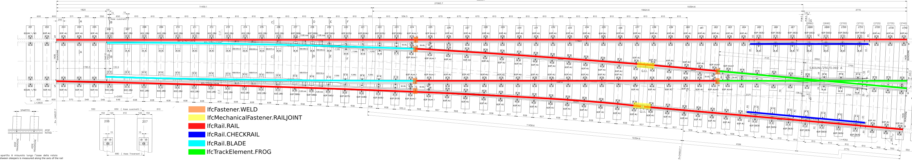

## Variations
The following occurrence variations need to be checked and certified in relation to the targeted entities and concept templates:

- IfcRail.RAIL - *requires Body AdvancedSweptSolid Geometry*
- IfcTrackElement.SLEEPER - *requires Mapped Geometry with Type Body Tessallated Geometry*
- IfcRail.CHECKRAIL - *requies Body Tessallation Geometry*
- IfcRail.BLADE - *requires Body Tessallation Geometry*
- IfcTrackElement.FROG - *requies Body Tessallation Geometry*
- IfcMechanicalFastener.RAILFASTENING - *requires Mapped Geometry with Type Body Tessallated Geometry*
- IfcMechanicalFastener.RAILJOINT - *requires Mapped Geometry with Type Body Tessallated Geometry*
- IfcFastener.WELD - *requires Mapped Geometry with Type Body Tessallated Geometry*
## Model Dataset
This test case utilises the attached dataset documented by the following drawings and data schedule. 

*This is a later step that involved the detailed documentation of the certification dataset (model)*

A track turnout panel is modelled as an instance of IfcElementAssembly with PredefinedType set to TURNOUTPANEL.
It is decomposed by elements including IfcRail.RAIL, IfcTrackElement.SLEEPER, IfcRail.CHECKRAIL, IfcRail.BLADE, IfcTrackElement.FROG, IfcMechnicalFastener.RAILFASTENING, IfcMechnicalFastener.RAILJOINT.
All the placement of these elements should be based on the placement of the turnout panel, and the turnout panel as an assembly is placed based on the alignment.
It is required to exchange start and end stationing of the turnout panel in the IFC file using IfcReferent.
It is required to define Product Type Geometry for IfcTrackElement.SLEEPER, IfcMechnicalFastener.RAILFASTENING and IfcMechnicalFastener.RAILJOINT.
- The geometry of IfcMechnicalFastener.RAILFASTENING and IfcMechnicalFastener.RAILJOINT as boxes that are placed according to the drawing.
- The geometry of IfcTrackElement.SLEEPER can be simplified and placed according to the drawing in Fig. 6.

Based on the imported IFC file from Test Case AL22, additional requirements for dataset are specified as follows.

Spatial (De)Composition Table

| **Parent Element** | **Parent Element Type** | **Parent Element Name** | **MinSize** | **MaxSize** | **Child Element** | **Child Element Type** | **Child Element Name** |
|--------------------|-------------------------|-------------------------|-------------|-------------|-------------------|------------------------|------------------------|
| IfcRailway         | Località                | LO1336                  | 1           | 1           | IfcFacilityPart   | TRACKSTRUCTURE         | LO1336-BC01            |
| IfcRailway         | Località                | LO1336                  | 1           | 1           | IfcFacilityPart   | TRACKSTRUCTURE         | LO1336-BC02            |

**NOTE**:
- when **MinSize** and **MaxSize** have the same value, it means exactly. Example: MinSize=MaxSize=1, means that the Parent Element must aggregates exactly 1 Child Element with that Type (and Name).

Spatial Containment Table

| **Spatial Element** | **Spatial Element Type** | **Spatial Element Name** | **MinSize** | **MaxSize** | **Element**     | **Element Type** | **Element Name** |
|---------------------|--------------------------|--------------------------|-------------|-------------|-----------------|------------------|------------------|
| IfcFacilityPart     | TRACKSTRUCTURE           | LO1336-BC01              | 1           | 1           | IfcElementAssembly        | TURNOUTPANEL             | turnout_panel_1      |

**NOTE**:
- when **MaxSize is empty**, it means **unlimited**. Example: MinSize=1; MaxSize=empty, means that the Spatial Element must contain 1 or more elements of the requested type.
- when **MinSize** and **MaxSize** have the same value, it means exactly. Example: MinSize=MaxSize=1, means that the Spatial Element must contain exactly 1 Element with that Type (and Name).

Element (De)Composition Table

| **Element Assembly** | **Assembly Type** | **MinSize** | **MaxSize** | **Element**     | **Element Type** |
|----------------------|--------------------------|-------------|-------------|-----------------|------------------|
| IfcElementAssembly   | TURNOUTPANEL           | 4           |      6       | IfcRail         | RAIL             |
| IfcElementAssembly   | TURNOUTPANEL           | 2           |      2       | IfcRail       | CHECKRAIL       |
| IfcElementAssembly   | TURNOUTPANEL           | 2           |      2       | IfcRail         | BLADE             |
| IfcElementAssembly   | TURNOUTPANEL           | 52           |     52        | IfcTrackElement | SLEEPER          |
| IfcElementAssembly   | TURNOUTPANEL           | 1           |      1       | IfcTrackElement | FROG          |
| IfcElementAssembly   | TURNOUTPANEL           | 2           |      2       | IfcMechanicalFastener | RAILFASTENING         |
| IfcElementAssembly   | TURNOUTPANEL           | 0           |             | IfcMechanicalFastener | RAILJOINT         |
| IfcElementAssembly   | TURNOUTPANEL           | 0           |      6       | IfcFASTENER | WELD         |

**NOTE**:
- when **MinSize** and **MaxSize** have the same value, it means exactly. Example: MinSize=MaxSize=1, means that the Assembly must aggregates exactly 1 Element with that Type (and Name).
- the **MinSize** and **MaxSize** defined in this table are according to drawing of the turnout panel. Please refer to Fig. 4 for the different parts of turnout panel. IfcMechnicalFastener.RAILJOINT and IfcFastener.WELD are optional to be instantiated in this test case, so their **MinSize** are 0.

Product Relative Positioning Table template

| **Product**     | **Product Type** | **Size** | **Positioning Element** | **Positioning Element Type** |
|---------------- |------------------|----------|-------------------------|------------------------------|
| IfcElementAssembly        | TURNOUTPANEL             | 2        | IfcReferent             |       STATION                |

Product Geometric Representation Table template

| **Product**     | **Product Type** | **Representation Identifier** | **Representation Type** |**Items**           |
|-----------------|------------------|-------------------------------|-------------------------|--------------------|
| IfcRail    | RAIL               | Body                          |       AdvancedSweptSolid           |1 IfcFixedReferenceSweptAreaSolid  |
| IfcRail    | BLADE               | Body                          |       AdvancedSweptSolid           |1 IfcFixedReferenceSweptAreaSolid  |
| IfcRail    | CHECKRAIL               | Body                          |       AdvancedSweptSolid           |1 IfcFixedReferenceSweptAreaSolid  |
| IfcTrackElement    | FROG               | Body                          |       AdvancedSweptSolid           |1 IfcFixedReferenceSweptAreaSolid  |
| IfcTrackElement    | SLEEPER               | Body                          |       AdvancedSweptSolid           |1 IfcFixedReferenceSweptAreaSolid  |  
| IfcMechanicalFastener    | RAILFASTENING               | Body                          |       AdvancedSweptSolid           |1 IfcFixedReferenceSweptAreaSolid  |
| IfcMechanicalFastener    | RAILJOINT               | Body                          |       AdvancedSweptSolid           |1 IfcFixedReferenceSweptAreaSolid  |
  

**NOTE**:
- Items should be listed in the cell with their number.
- One shape representation for a product should be documented in one row. If there are multiple representations, they should be documented in multiple rows.

Product Placement Table template

| **Product**     | **Product Type** | **Object Placement** | Relative Placement Product | Relative Placement Product Type |
|-----------------|------------------|----------------------|----------------------------|---------------------------------|
| IfcSite    | na               | IfcLocalPlacement    |                     |                               |
| IfcAlignment    | na               | IfcLocalPlacement    |  IfcSite                   |      na                         |
| IfcReferent    | na               | IfcLinearPlacement    |  IfcAlignment                   |      na                         |
| IfcElementAssembly    | TURNOUTPANEL               | IfcLocalPlacement   |  IfcReferent                   |      na                         |
| IfcRail    | RAIL               | IfcLocalPlacement   |  IfcElementAssembly                   |      TURNOUTPANEL                        |
| IfcRail    | CHECKRAIL               | IfcLocalPlacement   |  IfcElementAssembly                   |      TURNOUTPANEL                         |
| IfcRail    | BLADE               | IfcLocalPlacement   |  IfcElementAssembly                   |      TURNOUTPANEL                         |
| IfcTrackElement    | SLEEPER               | IfcLocalPlacement   |  IfcElementAssembly                   |      TURNOUTPANEL                         |
| IfcTrackElement    | FROG               | IfcLocalPlacement   |  IfcElementAssembly                   |      TURNOUTPANEL                         |
| IfcMechnicalFastener    | RAILFASTENING               | IfcLocalPlacement   |  IfcElementAssembly                   |      TURNOUTPANEL                         |
| IfcMechnicalFastener    | RAILJOINT               | IfcLocalPlacement   |  IfcElementAssembly                   |      TURNOUTPANEL                         |
| IfcFastener    | WELD               | IfcLocalPlacement   |  IfcElementAssembly                   |      TURNOUTPANEL                         |
  

**NOTE**:
- Columns **Relative Placement Product**, **Relative Placement Product Type**, **Relative Placement Product Name** are optional. If omitted, it means the Object Placement of the Product has no PlacementRelTo attribute.
  
The detailed structure of placement is specified as follows.

*Fig. 1 Placement of track turnout panel*

*Fig. 2 Placement of elements in track turnout panel*

Object Types Table template

| **Entity Type** | **Entity Type Name**    | **MinSize** | **MaxSize** | **IfcObject** | **IfcObject Name**          |
|-----------------|-------------------------|-------------|-------------|---------------|-----------------------------|
| IfcCourseType   | Segmento di massicciata | 1           |             | IfcCourse     | Segmento di massicciata M01 |
| IfcRailType     | Rotaia 60E1             | 1           |             | IfcRail       | Rotaia BC01 DX              |
| IfcRailType     | Rotaia 60E1             | 1           |             | IfcRail       | Rotaia BC01 SX              |

**NOTE**:
- when **Minimum** and **Maximum** have the same value, it means exactly. Example: Minimum=Maximum=1, means that the entity type must type exactly 1 object with that Name.
- when **Maximum is empty**, it means **unlimited**. Example: Minimum=1; Maximum=empty, means that the Entity Type must type 1 or more Object of the requested name.

## Drawings (Visualisations)
The following Drawings and visualisations describe the test case dataset to be modelled and certified.
Elements in the turnout panel should be classifed as shown in Fig. 4. 

*Fig. 3 Alignment of turnout panel*

*Fig. 4 Turnout panel drawing and element types*

The profile of rail (IfcRail.RAIL) should use the following drawing as reference.

*Fig. 5 Rail profile*

The sleeper and its simplified version

*Fig. 6 Sleeper and its relation to rails and the simplified version*

## Supporting files

| Filename                          | Description                               |
|-----------------------------------|-------------------------------------------|
| *FS60UNI_R.250_TG.0.092.svg*                        | *Drawing of track turnout panel*                       |
