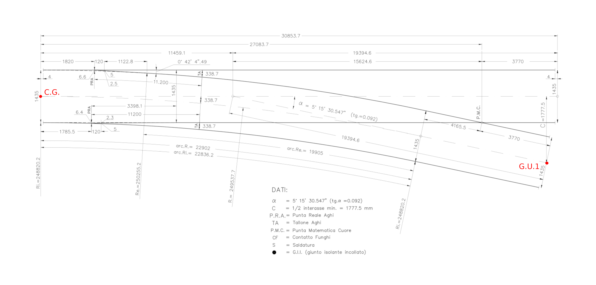

## Variations
The following occurrence variations need to be checked and certified in relation to the targeted entities and concept templates:

- IfcRail.RAIL - *requires Body AdvancedSweptSolid Geometry*
- IfcTrackElement.SLEEPER - *requires Mapped Geometry*
- IfcRail.CHECKRAIL - *requies Body Tessallation Geometry*
- IfcTrackElement.FROG - *requies Body Tessallation Geometry*
- IfcMechanicalFastner.RAILFASTENING - *requires Mapped Geometry*

## Model Dataset
This test case utilises the attached dataset documented by the following drawings and data schedule. 

*This is a later step that involved the detailed documentation of the certification dataset (model)*

A track turnout panel is modelled as an instance of IfcElementAssembly with Predefined Type TURNOUTPANEL.
It is decomposed by elements including IfcRail.RAIL, IfcTrackElement.SLEEPER, IfcRail.CHECKRAIL, IfcTrackElement.FROG, IfcMechnicalFastner.RAILFASTNING, IfcMechnicalFastner.RAILJOINT.
All the placement of these elements should be based on the placement of the turnout panel, and the turnout panel as an assembly is placed based on the alignment.
It is required to exchange start and end stationing of the turnout panel in the IFC file.
The detailed structure of placement is specified as follows.

*Placement of track turnout panel*

*Placement of elements in track turnout panel*

## Drawings (Visualisations)
The following Drawings and visualisations describe the test case dataset to be modelled and certified.

*alignment of turnout panel*

*turnout panel drawing and element types*

## Supporting files

| Filename                          | Description                               |
|-----------------------------------|-------------------------------------------|
| *FS60UNI_R.250_TG.0.092.svg*                        | *Drawing of track turnout panel*                       |
