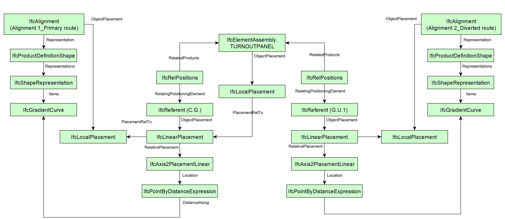

# Test Instruction

| Documentation Code   | Title                                          | Exchange Code | Test Code | Author          | Data Owner | Version | Date       |
|----------------------|------------------------------------------------|---------------|-----------| ----------------|------------|---------|------------|
| IFC4.3AbRV_E2a_TSTP   | Track Structures Turnout Panel                      | Ex2a-TRST            | TSTP      | Chi Zhang    | RFI        | 1.0     | 09.02.2022 |

## Summary (Intent)

This test instruction is defined for IFC4.3AbRV_E2a_TSTP Track Structures Turnout Panel.

It covers following subjects:
- A basic project structure setup including units, context and global positioning
- Two alignments for a section of railway, including the horizontal and vertical layouts
- A track turnout panel linearly placed based on one alignment
- Breakdown structure of a track turnout panel (simplified) with relative placement between elements and assembly
- Swept area solid geometry of rail elements in the turnout panel

The [Expected Results](#Expected-Results) section lists the material that will be used to assess the fulfilment of capabilities.

:zap: **This is a test-driven process: refer to the [Validation Criteria](#Validation-Criteria) to understand what is required by the test** :zap:

## Itemised Roots

The Test instruction addresses the import and export of the following IFC Entities & Concept Templates:

IFC Entities

These entities represent a test-specific subset of the wider AbRV_Ex exchange and the overall AbRV MVD. **The scope of the test shall not be used as a definitive scope of the exchange, or of the entire MVD.**

- Inherited from imported tests:
  - *IfcProject*
  - *IfcSite*
  - *IfcRailway*
  - *IfcAlignment*
  - *IfcAlignmentHorizontal*
  - *IfcAlignmentVertical*
  - *IfcAlignmentSegment*

- For this test instruction:
  - *IfcRailwayPart*
  - *IfcElementAssembly*
  - *IfcTrackElement*
  - *IfcRail*
  - *IfcMechnicalFastner*
  - *IfcFastener*
  - *IfcReferent*

Concept Templates

These concept templates represent a test-specific subset of the wider AbRV_Ex exchange and the overall AbRV MVD, that must be correctly exported to meet the validation criteria. **The scope of the test shall not be used as a definitive scope of the exchange, or of the entire MVD.**

- Inherited from imported tests:
  - *Project Units*
  - *Project Representation Context*
  - *Project Global Positioning*
  - *Spatial Decomposition*
  - *Spatial Composition*
  - *Alignment Layout*
  - *Alignment Geometry Gradient*
  - *Spatial Container*
  - *Product Local Placement*
  - *Object User Identity*
  - *Software Identity*
  - *Axis Geometry*
  
- For this test instruction:
  - *Product Linear Placement*
  - *Object Predefined Type*
  - *Element Composition*
  - *Element Decomposition*
  - *Product Relative Positioning*
  - *Product Span Positioning*
  - *Spatial Containment*
  - *Body AdvancedSwept Directrix Geometry*
  - *Body Tessallated Geometry*
  - *Object Typing*
  - *Type Body Tessellated Geometry*

## Test Case Imports
Test instructions are defined with a modular approach to reduce repetition of validation criteria and test content, and improve vendors ability to solve issues and bugs. therefore this test instruction *imports/reuses* the following Test instructions and entities with the relevant associated validation criteria.

Imports & Reuses

| TI Code                                  | Test Instruction Title    | Comments                     |
|------------------------------------------|---------------------------|------------------------------|
| [IFC4.3AbRV_E1_AL22](../../E2a-TRST/AL22) | (RFI) Two alignments without cant       | As outlined in the dataset Imported Entities Table |

## Usages, Constraints & Logic
The following itemised restrictions and constraints shall be placed on IFC Entities & Concept Templates:

Semantic Usages, Constraints & Logic

The following itemised Usages, Constraints & Logic are normative entries within the AbRV MVD and MUST be satisfied to meet the defined validation criteria

Model Geometry

The Test case requires the following additional checks related to Model Geometry:

- *Constraint*

## Expected Results

For certification of capabilities the only source will be:

- n. 1 IFC file containing the information as requested. The file shall be named using the following syntax: `MVDCode`-`ExchangeCode`-`TestCode`-`SoftwareVendor`.`ifc` (Example: `IFC4.3_AbRV-E2b-ASTPC-AmazingSoft.ifc`)

Considering the aim of this test, other **optional** results, not subject to the bSI certification process, yet useful to illustrate test results are:
- Screen-shot of the IFC file visualization
- Screen-shot of the IFC file structure (spatial decomposition, element decomposition).

---

## Validation criteria
:zap: For this test case to be considered passed **all capabilities** listed in this section shall be verified, with no exception. :zap:

### General & Imports

Click to expand

- All the concept templates must be correctly implemented as presented in the validation criteria
- At least 1 instance of each entity listed in [Itemised Roots](#Itemised-Roots) is present in the file.

#### Imports
| **TI Code**        | **Criteria Codes** | *COMMENT**                                         |
|--------------------|--------------------|----------------------------------------------------|
| IFC4.3AbRV_E1_AL22 | ALL CRITERIA       | As outlined in the dataset [Imported Entities Table](Dataset/README.md#Imported-Entities-Table) |

#### General

| **RULE ID** | **CRITERIA**                                                      | **VALUE [examples]**  | **ENTITY (if applicable)** | **CT (if applicable)**     |
|-------------|-------------------------------------------------------------------|-----------------------|----------------------------|----------------------------|
| GENE_00     | All validation criteria of precondition's tests shall be verified |                       | na                         | na                         |
| GENE_01     | All requested entities (and attributes) exist in file             | As per Entities Table | na                         | na                         |

	
### Spatial decomposition

Click to expand

| **RULE ID** | **CRITERIA**                      | **VALUE [examples]**               | **ENTITY (if applicable)** | **CT (if applicable)** |
|-------------|-----------------------------------|------------------------------------|----------------------------|------------------------|
| SDEC_01     | Spatial decomposition is verified | As per Spatial Decomposition Table | na                         | Spatial Decomposition  |

> **Acceptance criteria**: For the **Spatial decomposition** capability, the validation procedure must verify that a Parent Element of the requested type aggregates (via `IfcRelAggregates`) exactly a given number of Child Elements of the requested type, no more and no less.

- IfcProject
  - IfcSite
    - IfcRailway
	

### Spatial containment
	

Click to expand

| **RULE ID** | **CRITERIA**                    | **VALUE [examples]**             | **ENTITY (if applicable)** | **CT (if applicable)** |
|-------------|---------------------------------|----------------------------------|----------------------------|------------------------|
| SCON_01     | Spatial containment is verified | As per Spatial Containment Table | na                         | Spatial Containment    |

> **Acceptance criteria**: For the **Spatial containment** capability, the validation procedure must verify that a Spatial Element of the requested type contains (via `IfcRelContainedInSpatialStructure`) exactly a given number of Elements of the requested type, no more and no less.

- IfcRailway *(Name: LO1336)*
  - IfcElementAssembly.TURNOUTPANEL

### Placement structure
	

Click to expand

| **RULE ID** | **CRITERIA**                                                      | **VALUE [examples]**  | **ENTITY (if applicable)** | **CT (if applicable)**     |
|-------------|-------------------------------------------------------------------|-----------------------|----------------------------|----------------------------|
| SPCO_00     | ObjectPlacement of the element shall have PlacementRelTo referening the right IfcObjectPlacement |     see Fig. 1 and Fig. 2  | na | Product Placement |
	

*Fig. 1 Placement of track turnout panel*

*Fig. 2 Placement of elements in track turnout panel*

	

### Object nesting
	

Click to expand

	
| **RULE ID** | **CRITERIA**                                                      | **VALUE [examples]**  | **ENTITY (if applicable)** | **CT (if applicable)**     |
|-------------|-------------------------------------------------------------------|-----------------------|----------------------------|----------------------------|
| OBNE_00     | Each IfcReferent should be nested into the alignment where it is placed linearly |     1 IfcAlignment  | IfcReferent | Object Nesting (to be reversed) |

	

	
### Product geometric representation

Click to expand

Criteria around the representation of 'Some Concept'

| **RULE ID** | **CRITERIA**                                                      | **VALUE [examples]**  | **ENTITY (if applicable)** | **CT (if applicable)**     |
|-------------|-------------------------------------------------------------------|-----------------------|----------------------------|----------------------------|
| PRGE_00     | Correct representation identifier, type and items for occurrence element |  IfcFixedReferenceSweptAreaSolid  in SELF.Representation.Representations.Items  | IfcRail.RAIL | Body AdvancedSweptSolid Geometry |
| PRGE_00     | Correct representation identifier, type and items for occurrence element |  | IfcTrackElement.SLEEPER | Mapped Geometry |
| PRGE_01     | Correct representation identifier, type and items for type element |  | IfcTrackElementType.SLEEPER | Type Body Tessallated Geometry |

### Element decomposition

Click to expand

Criteria around the representation of 'Some Concept'

| **Element Assembly** | **Assembly Type** | **Minimum** | **Maximum** | **Element**     | **Element Type** |
|----------------------|--------------------------|-------------|-------------|-----------------|------------------|
| IfcElementAssembly   | TURNOUTPANEL           | 4           |      6       | IfcRail         | RAIL             |
| IfcElementAssembly   | TURNOUTPANEL           | 2           |      2       | IfcRail       | CHECKRAIL       |
| IfcElementAssembly   | TURNOUTPANEL           | 2           |      2       | IfcRail         | BLADE             |
| IfcElementAssembly   | TURNOUTPANEL           | 52           |     52        | IfcTrackElement | SLEEPER          |
| IfcElementAssembly   | TURNOUTPANEL           | 1           |      1       | IfcTrackElement | FROG          |
| IfcElementAssembly   | TURNOUTPANEL           | 2           |      2       | IfcMechanicalFastener | RAILFASTENING         |
| IfcElementAssembly   | TURNOUTPANEL           | 1           |             | IfcMechanicalFastener | RAILJOINT         |
| IfcElementAssembly   | TURNOUTPANEL           | 1           |      6       | IfcFASTENER | WELD         |

	

